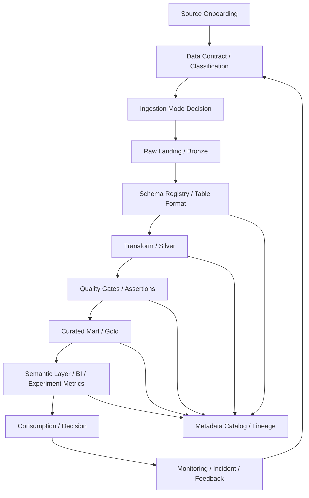

# Frontier Operating Model Research: データエンジニアリング・分析基盤（Layer 12）

- 生成日: 2026-05-13（Asia/Tokyo）
- 対象レイヤー: 12
- 指示書タイトルの推奨単位: データエンジニアリング・分析基盤
- 対象サブテーマ: file/block/object storage、metadata/catalog/schema registry/lineage、ingestion、ETL/ELT、batch/stream、queue/pubsub/broker、consumer group/offset、data quality/cleansing/transformation、warehouse/data mart/lake/lakehouse、BI/reporting/analytics/experimentation
- 準拠方法: `RESEARCH.md` の運用プレイブックに従い、公開情報限定、公式文書・標準・OSS ドキュメント優先、claim → evidence → Clone Spec の順に再構成した。

> 注記: 正式レイヤー名一覧は本依頼に含まれていないため、本レポートではユーザー指定のサブテーマを Layer 12 に割り当てた「運用上の仮レイヤー名」を用いる。正式カタログがある場合は、`layer_name_ja` のみを差し替えれば、definition / decision_question / source_refs は再利用できる。

---

## 1. Executive Summary

データエンジニアリング・分析基盤の先端運用は、単なるデータ保存・加工基盤ではなく、**データを安全に取り込み、契約として定義し、品質を検査し、再処理可能に変換し、意味レイヤー経由で意思決定に供給する制御システム**である。公開情報から観測できる frontier pattern は次の 7 点に集約される。

1. **オブジェクトストレージを分析基盤の物理基盤にし、テーブルフォーマットでトランザクション性を補う。** Amazon S3 と Google Cloud Storage は分析ワークロード向けに強整合性を明示し、Apache Iceberg / Delta Lake / Apache Hudi はスナップショット、スキーマ進化、ACID、履歴、メタデータを重ねる。[S01][S02][S03][S04][S05][S06][S07][S08]
2. **メタデータを「文書」ではなく「制御プレーン」にする。** Unity Catalog、DataHub、OpenMetadata、OpenLineage は、catalog、ownership、access control、lineage、quality、classification を運用判断の前提にしている。[S14][S15][S16][S25][S26][S44]
3. **schema registry / data contract で破壊的変更を入口で止める。** Confluent Schema Registry は schema versioning と compatibility mode を持ち、dbt model contracts は返却データセットの shape が契約に合わない場合に build を失敗させる。[S13][S17][S18]
4. **ingestion は initial load / incremental sync / CDC / replay を分離して設計する。** Airbyte、Fivetran、Debezium、Kafka Connect は、差分同期、connector state、CDC、offset、status topic を別々の運用対象として扱う。[S30][S31][S32][S33]
5. **batch と stream は同じ設計語彙に寄せるが、SLO と failure mode は別管理にする。** Beam、Spark Structured Streaming、Flink は bounded / unbounded、batch / stream の統一モデルを提供する一方、watermark、checkpoint、backpressure、exactly-once state consistency は streaming 固有の運用制約である。[S09][S10][S28][S29]
6. **BI と experimentation は semantic layer / metrics catalog / guardrail metrics によって統制する。** LookML、Power BI semantic model、Superset semantic layer、Statsig metrics / experiment configuration は、指標定義、分析ドメイン、guardrail を中央化する。[S38][S39][S40][S41][S42][S59]
7. **品質は後段検査ではなく、data product の SLO と incident workflow にする。** Great Expectations、SodaCL、DataHub Assertions は、expectation / checks / assertions を freshness、schema、volume、custom SQL などの検証単位として扱う。[S20][S21][S43]

このレイヤー群の Clone Spec は、**「one copy of governed data, many compute paths, one semantic truth」**を基本思想に置くべきである。すなわち、物理的には open object storage と warehouse / lakehouse を併用し、論理的には catalog、lineage、schema contract、quality gate、semantic model、experiment metrics を単一の evidence graph としてつなぐ。

---

## 2. Layer Registry（12）

| Layer ID | 仮レイヤー名 | Decision Object | Decision Question | 主な出力成果物 | 主オーナー |
|---:|---|---|---|---|---|
| 12.01 | Storage Workload Classification | block / file / object の使い分け | ワークロードの latency、sharing、mutability、scan pattern に応じて、どの storage primitive を採用するか | storage decision record | data platform architect |
| 12.02 | Block Storage | VM / database / local state 向け block device | 頻繁な更新・低遅延 I/O をどう block storage に閉じ、分析湖へ漏らさないか | volume spec, snapshot policy | infrastructure owner |
| 12.03 | File Storage | POSIX / NFS / shared filesystem | 複数 compute が同時アクセスする file workload をどう隔離・管理するか | filesystem mount policy | platform SRE |
| 12.04 | Object Storage / Landing Zone | object bucket / namespace / consistency | raw data landing と replay をどの bucket layout / retention / consistency 前提で設計するか | bucket layout, retention policy | data platform owner |
| 12.05 | Object Layout / Partitioning | path, partition, file size, compaction | query pruning と write cost を両立する object layout をどう決めるか | partition spec, compaction plan | lakehouse engineer |
| 12.06 | Lakehouse Table Format | Iceberg / Delta / Hudi transaction layer | object storage 上の table に ACID、schema evolution、time travel をどう持たせるか | table format standard | platform architecture board |
| 12.07 | Metadata Catalog | asset registry / glossary / owner | すべての data asset をどう発見可能・責任追跡可能にするか | catalog entry, glossary, domain map | data governance lead |
| 12.08 | Schema Registry | event / API schema lifecycle | producer / consumer 間の schema evolution をどう互換性制御するか | schema subject, version, compatibility policy | streaming platform owner |
| 12.09 | Data Contracts | producer-consumer contract | dataset shape、constraints、SLO、owner をどう build / deploy 前に検証するか | contract YAML, CI gate | analytics engineering lead |
| 12.10 | Lineage | job-run-dataset graph | 変更影響、root cause、監査に使える lineage をどう収集するか | lineage events, impact report | metadata platform owner |
| 12.11 | Source Onboarding | source system to platform intake | 新規 source を誰が承認し、どの頻度・契約・分類で取り込むか | source onboarding checklist | data product owner |
| 12.12 | CDC / Incremental Ingestion | change stream, cursor, state | full refresh を避け、差分・CDC・再処理をどう安全に運用するか | CDC config, cursor state | ingestion owner |
| 12.13 | Connector Management | connector fleet / sync schedule | connector の schema drift、API limit、failure、retry をどう管理するか | connector catalog, sync runbook | ingestion platform SRE |
| 12.14 | ETL / ELT Boundary | transform location and ownership | transformation を source 側、pipeline 側、warehouse/lakehouse 側のどこで行うか | ELT design decision | data architecture board |
| 12.15 | Transformation Modeling | model DAG / SQL / code transforms | 再現可能・テスト可能な変換モデルをどう構成するか | model DAG, versioned SQL, docs | analytics engineer |
| 12.16 | Batch Orchestration | DAG / schedule / dependencies | batch job の依存、backfill、retry、SLA miss をどう運用するか | Airflow/Dagster DAG, SLA policy | orchestration owner |
| 12.17 | Stream Processing | stateful compute / event time | unbounded data を event time、checkpoint、state でどう正確に処理するか | stream job spec, watermark policy | streaming engineer |
| 12.18 | Queue / PubSub / Broker | topics, shards, partitions, subscriptions | retention、ordering、delivery、fan-out、dead-letter をどう決めるか | topic spec, DLQ policy | event platform owner |
| 12.19 | Consumer Group Design | consumer group / subscription model | 並列性、順序、リバランス、競合する consumer をどう設計するか | consumer topology | streaming platform owner |
| 12.20 | Offset / Checkpoint / Replay | progress state and replay boundary | offset、checkpoint、transaction、sink state をどう同期し、再処理可能にするか | replay plan, checkpoint policy | streaming SRE |
| 12.21 | Data Quality Testing | expectation / assertion / check | freshness、schema、volume、null、uniqueness をどこで fail / warn にするか | quality test suite | data quality owner |
| 12.22 | Cleansing / Standardization | valid, canonical, quarantined data | raw data をどのルールで標準化し、不正値をどう隔離するか | cleansing spec, quarantine table | domain data steward |
| 12.23 | Quality Layering / Medallion | bronze / silver / gold | 生データ、検証済みデータ、業務集計をどう分離するか | medallion layer policy | lakehouse architect |
| 12.24 | Data Warehouse | governed analytical warehouse | high-concurrency BI / SQL analytics をどう warehouse で処理するか | warehouse model, workload mgmt | warehouse owner |
| 12.25 | Data Mart / Dimensional Model | fact / dimension / subject mart | 部門別意思決定に必要な mart をどう star schema 化するか | mart schema, dimensional model | analytics engineer |
| 12.26 | Data Lake / Lakehouse | unified open analytics substrate | lake、warehouse、AI/ML をどう単一 data copy / governance でつなぐか | lakehouse architecture | platform architect |
| 12.27 | BI / Reporting | dashboards, reports, certified datasets | どの report を certified にし、誰が metric correctness を保証するか | certified dashboard, report catalog | BI lead |
| 12.28 | Semantic / Metrics Layer | governed metrics and business terms | 指標定義をどう一元化し、重複・矛盾を防ぐか | semantic model, metrics catalog | metrics owner |
| 12.29 | Analytics Workspace | SQL Lab, notebooks, exploration | self-service 分析をどう production data product と分離・昇格するか | analysis workspace, promotion policy | analytics platform owner |
| 12.30 | Experimentation | experiment metrics, allocation, guardrails | A/B test の primary / guardrail metrics と判定ルールをどう決めるか | experiment registry, decision memo | experimentation owner |
| 12.31 | Data Observability / Reliability | freshness, lineage, incident | data incident をどう検知・影響範囲特定・復旧するか | monitor, incident, RCA | data reliability SRE |
| 12.32 | Data Platform Governance / FinOps | access, cost, audit, operating cadence | governance、cost、security、adoption をどう継続改善するか | governance review, FinOps report | data platform lead |

---

## 3. Frontier Exemplars and Candidate Scoring

採点軸は `RESEARCH.md` の Performance / Adoption / Artifact Richness / Peer Validation / Recency / Transferability / Failure Evidence を用いた。スコアは公開成果物密度と移植可能性を重視した 100 点換算である。

| Candidate / Pattern | 主対象レイヤー | 公開証拠の厚み | Score | 選定理由 |
|---|---:|---|---:|---|
| AWS S3 + Google Cloud Storage as object-store lake substrate | 12.01, 12.04, 12.26 | official docs, consistency model, cloud primitives | 91 | object storage の強整合性が、分析 lake の landing / replay / listing 前提を安定させる。[S01][S02][S03] |
| Apache Iceberg / Delta Lake / Apache Hudi | 12.05, 12.06, 12.23, 12.26 | specs, OSS docs, transaction/log models | 95 | object storage に ACID、snapshot、schema evolution、metadata planning、time travel を重ねる代表的 table format 群。[S04][S05][S06][S07][S08] |
| Apache Kafka + Confluent Schema Registry + Kafka Connect | 12.08, 12.18, 12.19, 12.20 | official docs, schema evolution docs, Connect configs | 92 | topic、consumer group、offset、transaction、schema compatibility を公開仕様として観測できる。[S08][S13][S33][S46] |
| Apache Flink + Apache Beam + Spark Structured Streaming | 12.17, 12.20 | OSS docs, programming guides | 89 | bounded / unbounded と stateful stream processing の frontier pattern を提供する。[S09][S10][S28][S29] |
| Debezium + Airbyte + Fivetran | 12.11, 12.12, 12.13 | official docs, connector docs | 83 | initial sync、incremental sync、CDC、connector state、API limit 対応の代表例。[S30][S31][S32] |
| Airflow + Dagster | 12.16, 12.15, 12.31 | official docs, DAG / asset orchestration docs | 84 | DAG orchestration と software-defined asset / lineage / observability の両面を観測できる。[S11][S12][S55] |
| Snowflake + BigQuery + Databricks Lakehouse | 12.24, 12.26, 12.32 | official docs, architecture docs | 88 | warehouse / lakehouse / governance / cost-performance の実装パターンが明確。[S22][S23][S24][S25][S27] |
| Unity Catalog + DataHub + OpenMetadata + OpenLineage | 12.07, 12.10, 12.31, 12.32 | official docs, metadata standards, open lineage spec | 93 | catalog、governance、lineage、quality、observability を統合 metadata graph に寄せる。[S14][S15][S16][S25][S44] |
| dbt + Looker + Power BI + Superset | 12.09, 12.15, 12.27, 12.28, 12.29 | official docs, semantic models, model contracts | 86 | transformation、documentation、semantic model、BI delivery の標準運用が観測できる。[S17][S18][S19][S38][S39][S40][S59] |
| Great Expectations + Soda + DataHub Assertions | 12.21, 12.22, 12.31 | official docs, expectation/check/assertion models | 85 | data quality を assertion / check / expectation として明示し、fail / warn / incident に接続する。[S20][S21][S43] |
| Statsig experimentation model | 12.30 | official docs for metrics and experiments | 77 | primary metrics、secondary/guardrail metrics、exploratory metrics の分離が明示される。[S41][S42] |

---

## 4. Evidence Map: Critical Claims

| Claim ID | Claim | Evidence | Evidence Type | Confidence | Decision Model Field |
|---|---|---|---|---|---|
| C01 | analytics lake の物理基盤は object storage が第一候補で、強整合性は landing / listing / replay の前提条件になる。 | S3 は PUT/DELETE と list/read-after-write の強整合性を明示し、GCS も Cloud Storage operations の strong consistency を説明する。[S01][S02][S03] | official docs | A | criteria, constraints |
| C02 | block storage は DB / VM / 低遅延更新向け、file storage は NFS/POSIX shared workload 向けであり、分析 lake と混同すべきでない。 | EBS は EC2 用 block storage、EFS / Filestore は file/NFS storage と定義される。[S51][S52][S53][S54] | official docs | A | prohibitions, storage decision |
| C03 | object storage だけでは warehouse 的な transaction / schema evolution / planning が不足するため、table format を標準化する必要がある。 | Iceberg は schema/partition evolution と scale、Delta Lake は ACID/scalable metadata/batch-stream unification、Hudi は timeline と atomic/timeline consistency を説明する。[S04][S05][S06][S07][S08] | spec / official docs | A | technical specification |
| C04 | metadata catalog は discovery のためだけでなく、governance、access control、quality、observability、lineage の制御プレーンになる。 | Unity Catalog は data/AI assets の centralized governance、DataHub は discovery/governance/observability、OpenMetadata は cataloging/governance/lineage/quality schemas を扱う。[S15][S16][S25][S26][S44] | official docs | A | controls, operating model |
| C05 | schema registry と data contracts は consumer 破壊を防ぐ change-management gate である。 | Schema Registry は compatibility mode と version ID を持ち、dbt contracts は dataset shape が合わなければ build しない。[S13][S17][S18] | official docs | A | rules, controls |
| C06 | lineage は job / run / dataset の実行イベントとして収集し、SQL parse の副産物だけにしない。 | OpenLineage は job execution の metadata collection standard で、run/job/dataset model と facets を定義する。[S14][S47][S48] | open standard docs | A | lineage, evidence graph |
| C07 | ingestion 設計では initial full sync、incremental sync、CDC、connector offset/state を別管理にする。 | Airbyte は incremental sync、Fivetran は sync frequency/status/offset、Debezium は log-based CDC、Kafka Connect は offset/status storage topic を扱う。[S30][S31][S32][S33] | official docs | A | ingestion model |
| C08 | batch と stream の統合モデルは有効だが、unbounded data には checkpoint、watermark、state、backpressure という追加制御が必要である。 | Beam は bounded/unbounded、Spark Structured Streaming は batch と同じ式で stream を表現、Flink は checkpoint による exactly-once state consistency を説明する。[S09][S10][S28][S29] | official docs | A | stream controls |
| C09 | broker 設計は topic/shard/partition だけでなく、delivery attempts、DLQ、ordering key、enhanced fan-out、consumer group/offset を decision object にする。 | Pub/Sub は ordering / dead-letter、Kinesis は shard/sequence number/enhanced fan-out、Kafka は topic/consumer/offset/transactions を扱う。[S08][S34][S35][S36][S37][S46] | official docs | A | queue design |
| C10 | data quality は assertion / expectation / check として codify し、契約違反時に fail / warn / incident に分岐する。 | GX は Expectation を verifiable assertion、SodaCL は checks YAML、DataHub Assertion は schema/freshness/volume/custom SQL rules と定義する。[S20][S21][S43] | official docs | A | quality controls |
| C11 | lakehouse / medallion architecture は bronze / silver / gold により raw、validated、curated を分離する実装 pattern である。 | Databricks medallion docs と Microsoft Fabric medallion docs は bronze/silver/gold の品質段階を説明する。[S27][S57] | official docs | A | transformation layers |
| C12 | warehouse / data mart は semantic model と star schema によって BI の performance と usability を高める。 | Power BI は semantic model と star schema guidance、LookML は semantic data model、Superset は semantic layer を示す。[S38][S39][S40][S59] | official docs | A | BI specification |
| C13 | experimentation では primary metrics を少数に絞り、guardrail / secondary metrics を別扱いする。 | Statsig は primary/secondary metrics と guardrails を experiment configuration に分ける。[S41][S42] | official docs | A | experimentation rules |
| C14 | data observability は freshness / schema / volume / lineage / incident をつなぐ必要がある。 | DataHub Assertions は data quality rules を incidents に接続し、Unity Catalog lineage は data flow visualization を提供する。[S25][S43] | official docs | B | observability controls |
| C15 | 強い基盤でも failure mode は消えない。典型的失敗は small files、schema drift、DLQ 放置、offset/sink 不整合、metric 重複、uncertified dashboards である。 | 各公式 docs が compaction/metadata/checkpoint/contract/DLQ/semantic model の必要性を示すことからの三角測量。[S04][S06][S08][S13][S20][S34][S40] | triangulated | B | failure modes |

---

## 5. Core Philosophy

1. **Storage is cheap; trust is expensive.** 保存容量よりも、再処理可能性、所有者、schema evolution、lineage、quality gate、access policy の欠落の方が高コストになる。
2. **Object storage is substrate; table format is contract.** lake は bucket ではなく、snapshot、schema、partition、manifest、transaction log、metadata catalog を含む table contract で初めて分析基盤になる。
3. **Metadata is the control plane.** catalog は検索画面ではなく、permission、classification、lineage、quality、incident、cost attribution を結ぶ制御プレーンである。
4. **Every pipeline has two outputs: data and evidence.** data table だけでなく、run status、lineage event、quality result、contract version、owner、cost、freshness SLO を成果物として残す。
5. **Separate raw fidelity from business truth.** raw layer は source fidelity と replay を守り、curated layer は business semantics と品質を守る。両者を同じテーブルに混ぜない。
6. **Exactly-once is a system property, not a vendor label.** broker、processor、sink、offset/checkpoint、idempotency、transaction boundary の全体が一致して初めて正確性が成立する。
7. **BI is software delivery.** dashboard、metric、semantic model、experiment decision は versioning、review、deprecation、incident 対応の対象である。

---

## 6. Decision Model

### 6.1 Inputs

- source system type: database, SaaS API, event stream, file drop, object bucket, warehouse export
- source contract: schema, owner, update cadence, API limits, retention, deletion semantics, PII / regulated fields
- workload type: batch, streaming, interactive BI, ML feature generation, experimentation, operational analytics
- latency target: real-time, near-real-time, hourly, daily, ad hoc
- correctness target: at-least-once acceptable, exactly-once required, eventual correction acceptable, audit-grade required
- data mutability: append-only, upsert, delete, CDC, SCD, late arriving events
- consumption pattern: dashboard, analyst SQL, notebook, model training, API, external sharing
- governance constraints: access scope, residency, classification, audit, data retention
- cost/performance constraints: query scan bytes, storage class, compute slots/warehouse size, stream shard/partition count
- failure tolerance: max tolerated staleness, duplicate tolerance, data loss tolerance, incident severity

### 6.2 Decision Object

このレイヤー群の decision object は、**「各データプロダクトを、どの storage substrate、table contract、metadata/lineage control、ingestion mode、transformation layer、quality gate、serving semantic、BI/experimentation policy で運用するか」**である。

### 6.3 Criteria

| Criterion | 実務判断 |
|---|---|
| Reliability | ingest、transform、serve の各段階に checkpoint、quality result、lineage、retry / DLQ を持つ。 |
| Reproducibility | raw retention、snapshot/time travel、versioned transformations、deterministic backfill を確保する。 |
| Evolvability | schema registry / data contract / table format evolution を使い、破壊的変更は migration window に隔離する。 |
| Governance | owner、classification、access policy、audit、lineage を catalog に集約する。 |
| Performance | partition、clustering、micro-partition、materialized view、semantic cache を query pattern に合わせる。 |
| Cost | storage class、file size、compaction、query scan bytes、warehouse auto-suspend、stream shards/slots を管理する。 |
| Usability | certified datasets、semantic metrics、star schema、dashboard lifecycle により消費者の認知負荷を下げる。 |
| Safety | PII masking、row/column policy、ABAC/RBAC、quarantine、guardrail metrics を運用に組み込む。 |

### 6.4 Priorities

1. Critical data product から owner / SLA / contract / quality / lineage を必須化する。
2. Raw は source fidelity と replay を優先し、Silver/Gold は business correctness を優先する。
3. Table format と catalog は先に標準化し、後からツールごとの個別最適を許可する。
4. stream は at-least-once + idempotent sink を原則にし、exactly-once は業務上必要な箇所だけ system-wide に設計する。
5. BI 指標は semantic layer / metrics catalog に昇格してから certified dashboard に使う。
6. Experiment は primary metrics、guardrails、sample allocation、decision memo が揃わない限り ship 判定しない。

### 6.5 Prohibitions

- raw bucket を直接 BI / dashboard source にする。
- schema drift を自動許容し、下流影響を catalog / lineage に記録しない。
- quality test が失敗しても critical table を更新し続ける。
- consumer offset と sink commit が別々に成功する設計で、重複・欠落を監視しない。
- metric 定義を dashboard ごとに重複実装する。
- DLQ / quarantine table を作るだけで owner、retention、reprocess policy を定義しない。
- catalog entry に owner、freshness SLO、classification、lineage のいずれもないまま production 扱いする。

### 6.6 Thresholds（初期値。各ドメインで調整）

| Threshold | 初期値 | 備考 |
|---|---:|---|
| Critical table owner coverage | 100% | owner 不明の critical data product は production 禁止。 |
| Critical table contract coverage | 90% 以上から開始、6か月で 100% | dbt contracts / schema registry / warehouse constraints のいずれか。 |
| Critical table freshness SLO breach | 1 breach = incident | 金融・課金・安全系は即時 incident。 |
| Schema incompatible change | 0 unreviewed | migration / versioning / deprecation plan が必要。 |
| Data quality hard-fail pass rate | 99%+ | fail 時は downstream publish を止める。 |
| Lineage coverage for certified assets | 95%+ | dashboard → semantic model → mart → source まで。 |
| BI certified dashboard review | quarterly | stale / unused / duplicate metrics を廃止。 |
| Stream consumer lag | workload-specific SLO | broker retention より十分短く保つ。 |
| DLQ unresolved age | P1/P2: 24–72h | DLQ は保存先ではなく incident queue。 |
| File size distribution | table-format-specific | small-file 増加時は compaction run。 |

### 6.7 Owners / Reviewers

- Data Platform Lead: platform standard、tooling、architecture board
- Domain Data Product Owner: data contract、SLO、business semantics
- Ingestion Owner: connector、CDC、sync schedule、source auth、backfill
- Lakehouse Engineer: table format、partition、compaction、storage layout
- Analytics Engineer: model DAG、dbt tests/contracts、marts、semantic layer
- BI Lead: certified dashboards、report lifecycle、metric correctness
- Metadata / Governance Lead: catalog、lineage、classification、access policy
- Data Reliability SRE: monitors、incident、RCA、runbooks、SLO breach
- Experimentation Owner: experiment design、metric selection、guardrails、decision memo
- Security / Privacy Reviewer: PII、masking、ABAC/RBAC、audit、retention
- FinOps Reviewer: compute/storage/query cost、warehouse sizing、reserved capacity

### 6.8 Cadence

| Cadence | 対象 |
|---|---|
| per pipeline run | quality checks、lineage event、run metadata、freshness update |
| daily | failed runs、SLO breach、DLQ/quarantine aging、consumer lag |
| weekly | connector failures、schema changes、cost spikes、top slow queries |
| monthly | catalog coverage、owner coverage、contract coverage、dashboard usage |
| quarterly | architecture review、BI certification review、backfill/replay drills、policy audit |
| release / major change | table format / schema / metric / semantic model migration review |

---

## 7. Operating Model

### 7.1 Core Process



### 7.2 Source Onboarding Checklist

1. source owner、technical contact、business owner を登録する。
2. source type、auth、API limit、expected volume、expected cadence、retention、delete semantics を記録する。
3. classification: PII、regulated、confidential、public、internal を付ける。
4. initial load と incremental / CDC の方式を分けて決定する。
5. schema contract と compatibility policy を決める。
6. raw landing path と table format を決める。
7. quality gate: hard-fail / warn / observe-only を分類する。
8. lineage emission と catalog entry creation を release gate にする。
9. backfill/replay procedure と owner を登録する。
10. downstream consumers と deprecation/migration window を定義する。

### 7.3 Data Product Promotion Gate

| Stage | 条件 | Publish 可否 |
|---|---|---|
| Experimental | owner あり、raw available、notebook/SQL で検証中 | production BI 禁止 |
| Candidate | schema documented、quality checks observe-only、lineage partial | limited consumers |
| Certified | contract enforced、critical quality pass、lineage complete、SLO defined、semantic model approved | production BI / experiment 使用可 |
| Deprecated | replacement と migration window あり | new usage 禁止 |
| Retired | downstream lineage 0、retention satisfied | delete / archive 可 |

---

## 8. Technical / Business Specification by Subtheme

### 8.1 File / Block / Object Storage

**Spec**

- block storage は VM、database、low-latency mutable state のために使う。EBS / Azure Managed Disks は block-level volume として定義される。[S51][S53]
- file storage は POSIX/NFS shared access を必要とする workload に使う。EFS / Filestore は serverless/managed file storage、NFS file server として定義される。[S52][S54]
- object storage は lake landing、append-heavy analytics、columnar files、table format storage に使う。S3 / GCS の strong consistency は listing と read-after-write の設計単純化に効く。[S01][S02][S03]
- object bucket は `domain/source/entity/load_date/` などの namespace だけでなく、table format の metadata path と catalog object をセットで管理する。
- storage policy は `retention`, `versioning`, `encryption`, `access`, `lifecycle`, `replication`, `legal hold`, `delete semantics` を含める。

**Decision Rules**

| Workload | 推奨 storage | 理由 |
|---|---|---|
| OLTP DB volume | block | random write、低遅延、database engine 管理が必要。 |
| shared ML / HPC filesystem | file | multiple readers/writers、NFS/POSIX semantics が必要。 |
| raw data landing | object | immutable / append、cost、durability、scale、table format 連携。 |
| lakehouse table | object + table format | object の scale と table transaction/evolution を両立。 |
| BI serving mart | warehouse / lakehouse table | governance、concurrency、semantic layer 連携。 |

### 8.2 Metadata / Catalog / Schema Registry / Lineage

**Spec**

- catalog entry は `asset_id`, `domain`, `owner`, `schema`, `classification`, `freshness_slo`, `quality_status`, `lineage`, `access_policy`, `cost_center`, `deprecation_status` を持つ。
- Unity Catalog 型の governance は access control、data discovery、data lineage、auditing、classification、quality monitoring を一体で扱う。[S25][S26]
- DataHub / OpenMetadata 型の metadata platform は data asset、dashboards、jobs、models、training runs まで graph 化する。[S15][S16][S44]
- OpenLineage は run / job / dataset を execution metadata として標準化する。dataset schema は schema facet として添付できる。[S14][S47][S48]
- schema registry は event-driven architecture の producer / consumer contract に置く。compatibility mode は backward / forward / full / transitive を明示する。[S13]
- dbt contracts は warehouse/lakehouse の model boundary に置く。contract が enforced の場合、返却 dataset が YAML 定義に合わなければ build を失敗させる。[S17][S18]

**Decision Rules**

- event topic は schema registry なしで production publish しない。
- certified table は catalog entry なしで production publish しない。
- lineage は batch transform、stream transform、BI semantic model、experiment metrics まで接続する。
- schema evolution は compatible change、breaking change、unknown drift に分類し、breaking change は migration plan を要求する。

### 8.3 Ingestion / CDC / Connectors

**Spec**

- initial load、incremental sync、CDC、manual backfill は別 job として記録する。
- Airbyte 型の incremental sync は「前回以降に変更されたデータだけを pull する」処理であり、API limit と大量 record 対策になる。[S31]
- Fivetran 型の connector は sync frequency、status、offset、error history を運用単位にする。[S32]
- Debezium 型の CDC は DB の change capture 機能を使い、polling や dual write よりも database changes capture を確実化する設計である。[S30]
- Kafka Connect は source connector offsets、connector/task status の storage topic を持つ。[S33]

**Decision Rules**

| Source Pattern | 推奨 Ingestion | 注意点 |
|---|---|---|
| SaaS API | connector + incremental sync | API limit、cursor、deleted record、schema drift。 |
| OLTP DB | CDC if supported | transaction log retention、snapshot phase、DDL drift。 |
| file drop | object landing + manifest | duplicate files、partial upload、late arrival。 |
| event source | broker topic + schema registry | ordering、idempotency、retention、DLQ。 |
| legacy source | scheduled extract + reconciliation | source lock、full refresh cost、data completeness。 |

### 8.4 ETL / ELT / Transformation

**Spec**

- 原則は ELT: raw / bronze に忠実に取り込み、warehouse/lakehouse 内で versioned SQL / model DAG として変換する。
- heavy cleansing や PII masking が source 近傍で必要な場合のみ ETL を採用する。
- dbt docs は curated datasets の発見・理解を支援し、project documentation を website として生成できる。[S18]
- model contract、tests、docs、lineage、semantic metrics を同じ repository / CI/CD に置く。
- medallion architecture は bronze = raw、silver = cleaned/validated、gold = curated business aggregates/features に分離する。[S27][S57]

**Decision Rules**

- bronze は source fidelity と replay、silver は validation/cleansing、gold は business semantics と consumption を最適化する。
- transformation model は input/output contract、owner、test、lineage、deployment history を持つ。
- backfill は business time と processing time を分けて計画する。

### 8.5 Batch / Stream / Queue / PubSub / Broker / Consumer Groups / Offsets

**Spec**

- Airflow の DAG は workflow、schedule、tasks、task dependencies をまとめる model であり、scheduler は dependencies が完了した task instances を trigger する。[S11][S12]
- Beam は bounded/unbounded data の統一 model、Spark Structured Streaming は batch computation と同じ書き方で stream を表現、Flink は unbounded/bounded data stream の stateful computation engine として checkpoint を使う。[S09][S10][S28][S29]
- Kafka は topics、durable events、consumer groups、exactly-once processing guarantees を扱う。[S08]
- Pub/Sub は ordering keys と dead-letter topics を使い、未 ack message や delivery attempts を管理する。[S34][S35]
- Kinesis は shard、sequence number、enhanced fan-out の throughput/consumer isolation を扱う。[S36][S37]

**Decision Rules**

| Decision | Rule |
|---|---|
| ordering | global ordering は避け、key-level ordering に限定する。 |
| delivery | default は at-least-once + idempotent sink。exactly-once は system-wide transaction/checkpoint が設計できる場合のみ。 |
| retention | replay window と consumer lag SLO より長くする。 |
| DLQ | DLQ は分析用墓場ではなく、owner と reprocess SLA を持つ incident queue。 |
| offsets | consumer offset と sink commit の整合性を監視する。 |
| checkpoint | checkpoint failure、state growth、backpressure を monitor する。 |
| fan-out | consumer 数・throughput・isolation 要件に応じて consumer group / subscription / enhanced fan-out を選ぶ。 |

### 8.6 Data Quality / Cleansing / Transformation

**Spec**

- Great Expectations の Expectation は data に対する verifiable assertion であり、Expectation Suite / Checkpoint / Validation Result を運用単位にする。[S20]
- SodaCL は YAML-based checks として pass / fail / error / warn を返す。[S21]
- DataHub Assertion は schema、freshness、volume、custom SQL などの data quality rule で、failure を incident に接続できる。[S43]
- cleansing は `drop`, `impute`, `standardize`, `deduplicate`, `normalize`, `mask`, `quarantine` を明示して、暗黙変換を避ける。

**Decision Rules**

- critical data product は quality hard gate を持つ。
- non-critical exploratory table は observe-only / warn から開始してよいが、certified 昇格時に hard gate 化する。
- cleansing rule は domain owner 承認が必要。technical convenience だけで business value を変更しない。
- quarantine table は retention、owner、reprocess logic、visibility を持つ。

### 8.7 Warehouse / Data Mart / Lake / Lakehouse

**Spec**

- Snowflake は micro-partition と metadata により query pruning と効率的処理を実現する。[S22]
- BigQuery は serverless architecture により infrastructure management を不要にする data platform / warehouse として定義される。[S23]
- materialized views は precomputed query result によって query time / cost を下げる用途がある。[S24]
- Databricks medallion は lakehouse の data quality layer を bronze/silver/gold に分ける。[S27]
- AWS modern data architecture は data lake、data warehouse、purpose-built stores を unified governance と seamless movement で統合する。[S49]
- Google は lakehouse を data lake の低コスト/flexible storage と warehouse の performance/structure/management を組み合わせる architecture と説明する。[S50]

**Decision Rules**

| Serving Need | 推奨設計 |
|---|---|
| highly governed executive BI | warehouse / gold mart + semantic layer |
| large-scale exploratory / ML | lakehouse table + notebook / Spark / SQL engine |
| domain reporting | data mart / star schema / conformed dimensions |
| repeated expensive query | materialized view / aggregate table / cache |
| open format interoperability | Iceberg / Delta / Hudi + catalog |

### 8.8 BI / Reporting / Analytics / Experimentation

**Spec**

- LookML は semantic data model を作る言語で、dimensions、aggregates、calculations、relationships を SQL database 上に記述する。[S38]
- Power BI semantic models は reporting / visualization ready の data source として扱われる。[S39]
- Power BI star schema guidance は fact / dimension table に分類する mature modeling approach を推奨する。[S59]
- Superset は physical / virtual datasets、unified metric definitions、semantic layer、dashboards、SQL Lab を提供する。[S40]
- dbt Semantic Layer は existing models 上に metrics を定義し、joins を処理する。[S19]
- Statsig は experiment primary metrics を少数にし、secondary metrics を guardrails / explanatory metrics として扱う。[S41][S42]

**Decision Rules**

- certified dashboard は certified dataset / semantic model 以外から作らない。
- metric owner と metric definition は dashboard owner から独立させる。
- exploration query は production mart へ昇格するまでは dashboard truth として扱わない。
- experiment decision memo は primary metric、guardrails、sample allocation、duration、exclusion、analysis method、ship/rollback decision を含む。

---

## 9. Metrics

| Category | Metrics |
|---|---|
| Storage / Lakehouse | object count, small-file ratio, avg file size, compaction backlog, table snapshot age, manifest count, storage cost/TB, lifecycle transition success |
| Ingestion | sync success rate, source freshness, API error rate, connector lag, CDC lag, initial load duration, incremental cursor delay, full refresh count, replay success |
| Stream / Broker | consumer lag, partition/shard utilization, rebalance count, checkpoint duration/failure, DLQ volume/age, duplicate rate, out-of-order rate, watermark delay |
| Transformation | model build success, test pass rate, contract violations, backfill duration, downstream impact count, transformation cost, lineage emission coverage |
| Data Quality | freshness pass rate, schema assertion pass rate, null/unique/volume anomaly rate, quarantine volume, quality incident MTTR, false positive rate |
| Catalog / Governance | catalog coverage, owner coverage, classification coverage, access-policy coverage, lineage depth, stale documentation age, deprecation completion rate |
| Warehouse / BI | p95 query latency, scan bytes/query, cost/query, dashboard load time, certified dashboard usage, duplicate metric count, semantic model adoption |
| Experimentation | experiment velocity, sample ratio mismatch rate, primary metric lift, guardrail regression rate, inconclusive rate, decision cycle time |
| Platform Reliability | data incident count, MTTD, MTTR, SLO breach count, change failure rate, rollback/replay success rate |
| FinOps | warehouse idle cost, slot/warehouse utilization, top expensive queries, storage growth, stream shard/partition cost, cost per active consumer |

---

## 10. Failure Modes and Mitigations

| Failure Mode | 症状 | 主原因 | Mitigation | Evidence Basis |
|---|---|---|---|---|
| Small-file explosion | query planning 遅延、metadata scan 増加 | streaming writes / tiny batch writes | compaction, clustering, table-format metadata tuning | S04, S06, S08 |
| Schema drift breaks consumers | dashboard / job failure | source field rename/type change | schema registry, dbt contract, compatibility check | S13, S17 |
| Raw data used as business truth | metric inconsistency | bronze/silver/gold 未分離 | medallion layering, certified mart | S27, S57 |
| DLQ becomes data graveyard | errors accumulate, no reprocess | no owner / no SLA | DLQ owner, retention, reprocess runbook | S34, S35 |
| Offset committed before sink write | data loss on failure | offset/sink transaction split | idempotent sink, transactional write, replay test | S08, S09, S46 |
| Sink write before offset commit | duplicate records | retry after partial success | idempotency key, merge key, dedup logic | S08, S30 |
| CDC snapshot/stream gap | missing changes | incorrect snapshot handoff | source log retention validation, snapshot protocol | S30 |
| Backpressure ignored | stream latency rises | downstream bottleneck | checkpoint metrics, queue size, NiFi/Flink backpressure monitoring | S09, S56 |
| Catalog stale | owner unknown, docs wrong | docs not generated from pipelines | automatic metadata ingestion, docs generation CI | S15, S18 |
| Lineage incomplete | impact analysis impossible | only manual lineage | OpenLineage runtime emission | S14, S47 |
| Metrics duplicated | teams disagree on revenue/user | dashboard-local metric definitions | semantic layer / metrics catalog | S19, S38, S39, S40 |
| Warehouse cost runaway | scan bytes / warehouse runtime spike | no partition/materialized view/cost review | cost dashboard, materialized views, warehouse auto policies | S22, S23, S24 |
| Over-claiming exactly-once | false confidence | broker guarantee misunderstood | system-level guarantee review | S08, S09, S46 |
| Quality tests too strict | frequent false alarms | poor thresholds, no severity | hard/warn/observe tiers, baseline profiling | S20, S21, S43 |
| Quality tests too weak | bad data reaches exec dashboard | missing critical checks | contract + critical assertion gate | S17, S20, S43 |
| Experiment ships harmful change | primary metric lift masks harm | no guardrails | guardrail metrics, secondary metrics review | S41, S42 |
| BI report sprawl | contradictory dashboards | no certification/deprecation | report catalog, usage review, certified datasets | S38, S39, S40 |
| Access policy drift | excessive access / audit risk | manual grants | catalog-based ABAC/RBAC, audit logs | S25, S26 |

---

## 11. Anti-patterns

1. 「データレイク = S3 bucket」と定義し、table format / catalog / quality / lineage を後回しにする。
2. source system の schema を producer 都合で変更できるが、consumer 影響分析を持たない。
3. すべてを full refresh で解決し、差分同期・CDC・cursor・backfill を設計しない。
4. stream processing で exactly-once を product label として採用し、sink transaction と offset 整合性を検証しない。
5. bronze, silver, gold を命名だけに使い、品質・契約・消費者を分けない。
6. BI dashboard ごとに revenue / active user / conversion の定義を再実装する。
7. data quality tool を導入しても、fail 時に publish を止めるか、warn にするかを決めない。
8. catalog を人手 wiki として運用し、pipeline から metadata を自動更新しない。
9. lineage をデモ用グラフとして扱い、incident / impact analysis / deprecation に使わない。
10. DLQ と quarantine を retention 無制限で放置する。
11. mart を作らず、BI が直接 source table / raw table を join する。
12. experiment の primary metrics を多数設定し、意思決定基準を曖昧にする。
13. notebook の exploratory query を production pipeline と同列に扱う。
14. storage/warehouse cost を central platform team だけで見て、domain owner に配賦しない。
15. データ削除・PII masking・retention を table lifecycle から切り離す。

---

## 12. Maturity Model

| Level | Name | Criteria |
|---:|---|---|
| 0 | 未整備 | storage は ad hoc、owner 不明、raw data が dashboard に直結、品質検査なし。 |
| 1 | 個人依存 | pipeline は存在するが、手作業 backfill、属人的 SQL、手動 docs。 |
| 2 | 文書化 | source catalog、DAG、basic tests、dashboard list はあるが、自動 lineage / contract は限定的。 |
| 3 | 標準化 | object layout、table format、catalog、schema registry、dbt contracts、quality checks が標準化される。 |
| 4 | 自動化・計測 | lineage emission、quality gates、freshness SLO、incident workflow、FinOps dashboards が自動運用される。 |
| 5 | 自律改善・業界先端 | data product ごとに SLO / cost / quality / adoption が継続最適化され、semantic metrics と experimentation が意思決定に直結する。 |

---

## 13. Clone Implementation Guide

### 13.1 0–30 Days: Control Plane Baseline

- critical data products を 20–50 個選び、owner、consumer、freshness、classification、dashboard dependency を棚卸しする。
- storage decision record を作る。block/file/object を workload ごとに分類し、raw landing を object storage に統一する。
- catalog minimum fields を定義する: owner、domain、classification、schema、freshness SLO、lineage placeholder、quality status。
- schema registry / data contract 対象を決める。event topics と critical marts から開始する。
- ingestion registry を作る。source、connector、sync mode、cursor/offset、schedule、failure owner を登録する。
- certified dashboard を仮指定し、各 dashboard の source table と metric definition を抽出する。

### 13.2 31–60 Days: Contracts, Quality, Lineage

- critical tables に dbt contract / schema registry compatibility / warehouse constraints のいずれかを導入する。
- Great Expectations / Soda / DataHub Assertions 等で freshness、schema、volume、null、unique の最小 quality suite を実装する。
- OpenLineage 互換 emission または metadata ingestion を Airflow/dbt/Spark/Flink jobs に接続する。
- bronze/silver/gold の promotion gate を定義する。
- DLQ/quarantine の owner、retention、reprocess procedure を定義する。
- BI semantic layer / metrics catalog の pilot を revenue、active user、conversion など少数の指標で開始する。

### 13.3 61–90 Days: Productionization

- table format standard を決定する。Iceberg / Delta / Hudi の採用条件、catalog integration、partition evolution、compaction、time travel policy を書く。
- streaming workloads に offset/checkpoint/replay drill を実施する。
- certified dashboards だけを executive reporting に使う policy を運用開始する。
- experiment registry を作り、primary metrics と guardrails のテンプレートを義務化する。
- platform SLO dashboard を作る: freshness、quality pass、lineage coverage、catalog coverage、cost、incident MTTR。
- quarterly architecture review と monthly data product review を定例化する。

### 13.4 Required Artifacts

| Artifact | Owner | Minimum Fields |
|---|---|---|
| Storage Decision Record | platform architect | workload, storage primitive, consistency, retention, cost, risks |
| Source Contract | source owner | schema, update cadence, delete semantics, PII, API limit, contact |
| Data Contract | data product owner | columns, types, constraints, SLO, compatibility, migration plan |
| Pipeline Spec | ingestion / analytics engineer | DAG, schedule, retries, backfill, dependencies, run metadata |
| Quality Suite | data quality owner | expectations/checks/assertions, severity, thresholds, actions |
| Lineage Event Spec | metadata owner | run, job, dataset, input/output, schema facet, producer |
| Semantic Model | metrics owner | dimensions, measures, relationships, metric definitions, owner |
| Experiment Decision Memo | experimentation owner | hypothesis, allocation, primary metrics, guardrails, decision |
| Incident Runbook | data reliability SRE | detection, impact, owner, mitigation, replay/backfill, RCA |
| Cost Report | FinOps owner | storage, compute, query cost, owner, anomaly, optimization backlog |

---

## 14. Pattern Library

| Pattern ID | Pattern | Layer Scope | Preconditions | Tradeoffs | Confidence |
|---|---|---|---|---|---|
| P01 | Object Store + Open Table Format | 12.04–12.06, 12.26 | strong-consistent object store, catalog, compute engines | table format lock-in / interoperability concerns | A |
| P02 | Metadata Control Plane | 12.07, 12.10, 12.31, 12.32 | catalog ingestion, owner model, access policy | requires governance ownership | A |
| P03 | Contract-first Data Product | 12.08, 12.09, 12.21 | schema registry / dbt contracts, CI/CD | slows ungoverned iteration | A |
| P04 | Medallion Quality Progression | 12.22, 12.23, 12.26 | raw retention, transform ownership | layer sprawl if not governed | A |
| P05 | At-least-once + Idempotent Sink Default | 12.17–12.20 | deterministic keys, merge/upsert sink | some duplicates require cleanup | B |
| P06 | Runtime Lineage Emission | 12.10, 12.31 | orchestration / jobs emit events | integration overhead | A |
| P07 | Quality Gate Severity Tiers | 12.21, 12.22 | check framework and incident process | threshold tuning effort | A |
| P08 | Certified Semantic Metrics | 12.27, 12.28, 12.30 | semantic layer, metric owner | may constrain analyst freedom | A |
| P09 | DLQ as Incident Queue | 12.18, 12.31 | owner and reprocess SLA | more operational burden | B |
| P10 | Domain Data Product Review | 12.11, 12.32 | domain ownership and platform metrics | governance cadence needed | B |

---

## 15. Validation Queries

次のクエリは、主要 claim を崩しに行くための反証・鮮度確認用である。

```text
site:aws.amazon.com/s3/consistency "strong consistency" "Amazon S3"
site:docs.cloud.google.com/storage/docs/consistency "eventually consistent" "Cloud Storage"
site:iceberg.apache.org/docs "schema evolution" "partition evolution" "snapshot"
site:docs.delta.io "ACID" "metadata" "time travel"
site:hudi.apache.org/docs "timeline" "atomic" "metadata table"
site:docs.confluent.io "Schema Registry" "compatibility" "BACKWARD"
site:docs.getdbt.com "model contracts" "does not build"
site:openlineage.io/docs "Run" "Job" "Dataset" "facets"
site:debezium.io/documentation "change data capture" "log-based"
site:docs.airbyte.com "Incremental Sync" "cursor"
site:fivetran.com/docs "sync frequency" "offset"
site:kafka.apache.org/documentation "consumer group" "exactly-once"
site:nightlies.apache.org/flink "checkpoint" "exactly-once" "backpressure"
site:docs.cloud.google.com/pubsub "dead-letter" "ordering"
site:docs.aws.amazon.com/streams "enhanced fan-out" "shard"
site:docs.greatexpectations.io "Expectation" "verifiable assertion"
site:docs.soda.io "SodaCL" "checks" "pass" "fail"
site:docs.datahub.com "Assertion" "Freshness" "Schema"
site:docs.databricks.com "medallion" "bronze" "silver" "gold"
site:learn.microsoft.com/en-us/power-bi/guidance "star schema"
site:docs.cloud.google.com/looker/docs "LookML" "semantic data model"
site:docs.statsig.com "primary metrics" "guardrail"
"Apache Iceberg" (incident OR CVE OR breaking change OR migration)
"Delta Lake" (incident OR CVE OR breaking change OR migration)
"Apache Kafka" (incident OR outage OR exactly-once OR transaction)
"dbt model contracts" (breaking OR migration OR limitation)
"data lake" "small files" "compaction" official docs
```

---

## 16. Confidence & Unknowns

### 確度A

- object storage の strong consistency は S3 / GCS の公式文書で確認できる。[S01][S02][S03]
- Iceberg / Delta / Hudi が table format として schema evolution、ACID / transaction / timeline / metadata を扱うことは公式文書で確認できる。[S04][S05][S06][S07][S08]
- Schema Registry、dbt contracts、OpenLineage、GX/Soda/DataHub Assertions の基本機能は公式文書で確認できる。[S13][S14][S17][S20][S21][S43]
- Airflow DAG / scheduler、Beam bounded/unbounded、Spark Structured Streaming、Flink checkpoint の基本設計は公式文書で確認できる。[S09][S10][S11][S12][S28][S29]
- LookML、Power BI semantic model/star schema、Superset semantic layer、Statsig primary/guardrail metrics は公式文書で確認できる。[S38][S39][S40][S41][S42][S59]

### 確度B

- 「metadata is control plane」は Unity Catalog / DataHub / OpenMetadata / OpenLineage の公開機能を三角測量した operational pattern であり、特定標準の用語ではない。[S14][S15][S16][S25][S44]
- 「exactly-once is a system property」は Kafka/Flink 公式仕様と stream sink/offset の既知設計原理からの合成であり、個別製品の保証範囲を超えて一般化している。[S08][S09][S46]
- warehouse / lakehouse / mart の使い分けは Snowflake / BigQuery / Databricks / AWS / Google / Microsoft の公開文書を組み合わせた実務判断である。[S22][S23][S24][S27][S49][S50][S59]

### 確度C

- 具体的な SLA 数値、freshness threshold、cost target は組織ドメインに依存するため、本レポートでは初期値に留めた。
- 各 vendor の内部 review board、incident triage、private runbook は公開情報だけでは確定できない。
- frontier exemplar のスコアは公開証拠密度に基づく評価であり、市場シェアや導入実績の厳密ランキングではない。

### 追加調査

1. 対象企業・組織がある場合、EDGAR / IR / engineering blog / public postmortem を追加して candidate score を実組織別に再計算する。
2. 対象 stack が AWS / GCP / Azure / Databricks / Snowflake などに決まっている場合、source catalog を platform-specific に圧縮する。
3. Layer 12 の正式名称がある場合、layer_registry の仮名を正式名に置換する。
4. BI / experimentation は組織文化依存が大きいため、公開事例よりも内部 governance policy と metric catalog の棚卸しで補強する。

---

## 17. Source Catalog

| Source ID | Entity | Source Title | Type | Tier | URL |
|---|---|---|---|---|---|
| S01 | AWS | Amazon S3 Strong Consistency | official_doc | T2 | https://aws.amazon.com/s3/consistency/ |
| S02 | AWS | What is Amazon S3? / Amazon S3 data consistency model | official_doc | T2 | https://docs.aws.amazon.com/AmazonS3/latest/userguide/Welcome.html |
| S03 | Google Cloud | Cloud Storage consistency | official_doc | T2 | https://docs.cloud.google.com/storage/docs/consistency |
| S04 | Apache Iceberg | Apache Iceberg Table Spec | spec | T0 | https://iceberg.apache.org/spec/ |
| S05 | Apache Iceberg | Evolution | official_doc | T0 | https://iceberg.apache.org/docs/latest/evolution/ |
| S06 | Delta Lake | Welcome to the Delta Lake documentation | official_doc | T2 | https://docs.delta.io/ |
| S07 | Databricks | What is Delta Lake in Databricks? | official_doc | T2 | https://docs.databricks.com/aws/en/delta/ |
| S08 | Apache Hudi | Concepts / Timeline | official_doc | T2 | https://hudi.apache.org/docs/concepts/ |
| S09 | Apache Flink | Stateful Stream Processing | official_doc | T2 | https://nightlies.apache.org/flink/flink-docs-stable/docs/concepts/stateful-stream-processing/ |
| S10 | Apache Flink | Apache Flink: Stateful Computations over Data Streams | official_doc | T2 | https://flink.apache.org/ |
| S11 | Apache Airflow | DAGs | official_doc | T2 | https://airflow.apache.org/docs/apache-airflow/stable/core-concepts/dags.html |
| S12 | Apache Airflow | Scheduler | official_doc | T2 | https://airflow.apache.org/docs/apache-airflow/stable/administration-and-deployment/scheduler.html |
| S13 | Confluent | Schema Evolution and Compatibility Types | official_doc | T2 | https://docs.confluent.io/platform/current/schema-registry/fundamentals/schema-evolution.html |
| S14 | OpenLineage | About OpenLineage | standard_doc | T0 | https://openlineage.io/docs/ |
| S15 | DataHub | DataHub Docs Overview | official_doc | T2 | https://docs.datahub.com/docs/introduction |
| S16 | DataHub | Metadata Standards | official_doc | T2 | https://docs.datahub.com/docs/metadata-standards |
| S17 | dbt Labs | Model contracts | official_doc | T2 | https://docs.getdbt.com/docs/mesh/govern/model-contracts |
| S18 | dbt Labs | contract resource config | official_doc | T2 | https://docs.getdbt.com/reference/resource-configs/contract |
| S19 | dbt Labs | dbt Docs / Semantic Layer | official_doc | T2 | https://docs.getdbt.com/ |
| S20 | Great Expectations | GX Core overview | official_doc | T2 | https://docs.greatexpectations.io/docs/core/introduction/gx_overview/ |
| S21 | Soda | Write SodaCL checks | official_doc | T2 | https://docs.soda.io/soda-documentation/soda-v3/soda-cl-overview |
| S22 | Snowflake | Micro-partitions and Data Clustering | official_doc | T2 | https://docs.snowflake.com/en/user-guide/tables-clustering-micropartitions |
| S23 | Google Cloud | BigQuery overview | official_doc | T2 | https://docs.cloud.google.com/bigquery/docs/introduction |
| S24 | Google Cloud | BigQuery materialized views introduction | official_doc | T2 | https://docs.cloud.google.com/bigquery/docs/materialized-views-intro |
| S25 | Databricks | Data governance with Databricks / Unity Catalog | official_doc | T2 | https://docs.databricks.com/aws/en/data-governance/ |
| S26 | Databricks | Access control in Unity Catalog | official_doc | T2 | https://docs.databricks.com/aws/en/data-governance/unity-catalog/access-control/ |
| S27 | Databricks | Medallion lakehouse architecture | official_doc | T2 | https://docs.databricks.com/aws/en/lakehouse/medallion |
| S28 | Apache Beam | Apache Beam Overview | official_doc | T2 | https://beam.apache.org/get-started/beam-overview/ |
| S29 | Apache Spark | Structured Streaming Programming Guide | official_doc | T2 | https://spark.apache.org/docs/latest/streaming/index.html |
| S30 | Debezium | Debezium Features | official_doc | T2 | https://debezium.io/documentation/reference/stable/features.html |
| S31 | Airbyte | Incremental Sync | official_doc | T2 | https://docs.airbyte.com/platform/connector-development/connector-builder-ui/incremental-sync |
| S32 | Fivetran | Connectors sync overview | official_doc | T2 | https://fivetran.com/docs/core-concepts/syncoverview |
| S33 | Apache Kafka / Kafka Connect | Kafka Connect Configs | official_doc | T2 | https://kafka.apache.org/39/configuration/kafka-connect-configs/ |
| S34 | Google Cloud Pub/Sub | Order messages | official_doc | T2 | https://docs.cloud.google.com/pubsub/docs/ordering |
| S35 | Google Cloud Pub/Sub | Dead-letter topics | official_doc | T2 | https://docs.cloud.google.com/pubsub/docs/dead-letter-topics |
| S36 | AWS | Kinesis Data Streams terminology and concepts | official_doc | T2 | https://docs.aws.amazon.com/streams/latest/dev/key-concepts.html |
| S37 | AWS | Kinesis enhanced fan-out consumers | official_doc | T2 | https://docs.aws.amazon.com/streams/latest/dev/enhanced-consumers.html |
| S38 | Google Cloud Looker | Introduction to LookML | official_doc | T2 | https://docs.cloud.google.com/looker/docs/what-is-lookml |
| S39 | Microsoft Power BI | Semantic models in the Power BI service | official_doc | T2 | https://learn.microsoft.com/en-us/power-bi/connect-data/service-datasets-understand |
| S40 | Apache Superset | Superset introduction / semantic layer | official_doc | T2 | https://superset.apache.org/user-docs/intro/ |
| S41 | Statsig | Configuring Experiments | official_doc | T2 | https://docs.statsig.com/statsig-warehouse-native/features/configure-an-experiment |
| S42 | Statsig | Metrics Overview | official_doc | T2 | https://docs.statsig.com/statsig-warehouse-native/configuration/metrics |
| S43 | DataHub | Assertion entity / data quality rules | official_doc | T2 | https://docs.datahub.com/docs/generated/metamodel/entities/assertion |
| S44 | OpenMetadata | Metadata Standard / OpenMetadata Core Schema Guide | official_doc | T2 | https://docs.open-metadata.org/v1.12.x/api-reference/main-concepts/metadata-standard |
| S45 | Apache Atlas | Apache Atlas project home | official_doc | T2 | https://atlas.apache.org/ |
| S46 | Apache Kafka | KIP-98 Exactly Once Delivery and Transactional Messaging | design_doc | T3 | https://cwiki.apache.org/confluence/display/KAFKA/KIP-98%2B-%2BExactly%2BOnce%2BDelivery%2Band%2BTransactional%2BMessaging |
| S47 | OpenLineage | Facets and Extensibility | standard_doc | T0 | https://openlineage.io/docs/spec/facets/ |
| S48 | OpenLineage | Schema Dataset Facet | standard_doc | T0 | https://openlineage.io/docs/spec/facets/dataset-facets/schema/ |
| S49 | AWS | Modern data architecture - Analytics Lens | official_doc | T2 | https://docs.aws.amazon.com/wellarchitected/latest/analytics-lens/modern-data-architecture.html |
| S50 | Google Cloud | What is a Data Lakehouse? | official_doc | T2 | https://cloud.google.com/discover/what-is-a-data-lakehouse |
| S51 | AWS | Amazon EBS persistent block storage | official_doc | T2 | https://docs.aws.amazon.com/AWSEC2/latest/UserGuide/storage_ebs.html |
| S52 | AWS | What is Amazon Elastic File System? | official_doc | T2 | https://docs.aws.amazon.com/efs/latest/ug/whatisefs.html |
| S53 | Microsoft Azure | Overview of Azure Disk Storage | official_doc | T2 | https://learn.microsoft.com/en-us/azure/virtual-machines/managed-disks-overview |
| S54 | Google Cloud | Filestore documentation | official_doc | T2 | https://docs.cloud.google.com/filestore/docs |
| S55 | Dagster | Dagster Docs Overview | official_doc | T2 | https://docs.dagster.io/ |
| S56 | Apache NiFi | Apache NiFi User Guide / Back Pressure | official_doc | T2 | https://nifi.apache.org/docs/nifi-docs/html/user-guide.html |
| S57 | Microsoft Fabric | Implement Medallion Lakehouse Architecture in Fabric | official_doc | T2 | https://learn.microsoft.com/en-us/fabric/onelake/onelake-medallion-lakehouse-architecture |
| S58 | BigQuery | Specifying a schema | official_doc | T2 | https://docs.cloud.google.com/bigquery/docs/schemas |
| S59 | Microsoft Power BI | Understand star schema and the importance for Power BI | official_doc | T2 | https://learn.microsoft.com/en-us/power-bi/guidance/star-schema |

---

## 18. Compact Claims Registry

| claim_id | layer_id | claim_type | decision_model_field | confidence | status | source_refs |
|---|---:|---|---|---|---|---|
| C01 | 12.04 | rule | constraints | A | supported | S01,S02,S03 |
| C02 | 12.01 | decision_rule | storage classification | A | supported | S51,S52,S53,S54 |
| C03 | 12.06 | principle | technical specification | A | supported | S04,S05,S06,S07,S08 |
| C04 | 12.07 | principle | controls | A | supported | S15,S16,S25,S26,S44 |
| C05 | 12.08 | rule | schema evolution | A | supported | S13,S17,S18 |
| C06 | 12.10 | rule | lineage | A | supported | S14,S47,S48 |
| C07 | 12.12 | rule | ingestion | A | supported | S30,S31,S32,S33 |
| C08 | 12.17 | tradeoff | stream controls | A | supported | S09,S10,S28,S29 |
| C09 | 12.18 | rule | queue/pubsub/broker | A | supported | S08,S34,S35,S36,S37,S46 |
| C10 | 12.21 | rule | quality controls | A | supported | S20,S21,S43 |
| C11 | 12.23 | principle | transformation layers | A | supported | S27,S57 |
| C12 | 12.27 | principle | BI semantic model | A | supported | S38,S39,S40,S59 |
| C13 | 12.30 | rule | experimentation metrics | A | supported | S41,S42 |
| C14 | 12.31 | principle | observability | B | supported | S25,S43,S14 |
| C15 | 12.32 | failure_pattern | governance / FinOps | B | supported | S15,S16,S49,S50 |

---

## 19. QA Checklist Result

| Check | Result | Notes |
|---|---|---|
| Coverage | Pass | Layer 12 を storage、metadata、ingestion、processing、quality、serving、BI/experiment、governance に分解。 |
| Critical Claim | Pass | 主要 claim は公式/OSS docs を中心に A/B 化。 |
| Recency | Pass with caveat | 2026-05-13 時点の検索結果。特定 version は追加確認推奨。 |
| Exceptions | Pass | storage type、exactly-once、quality severity、DLQ、experiment guardrail で例外条件を記載。 |
| Failure | Pass | failure modes / anti-patterns / validation queries を記載。 |
| Provenance | Pass | 各 claim に source_refs を付与。 |
| Registry Integrity | Pass | layer_registry / source_catalog / claims_registry 形式で出力。 |
| Output Integrity | Pass | Clone Spec 必須欄に相当する definition、exemplars、evidence、philosophy、decision_model、operating_model、spec、metrics、failure、anti-pattern、maturity、implementation、unknowns を含む。 |
