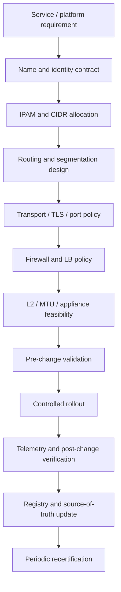

# Clone Spec: ネットワーク工学（20）

Generated at: 2026-05-13 JST  
Instruction title unit: ネットワーク工学  
Target layers: 20  
Scope: DNS、resolver、zone、record、TCP/UDP/port/TLS、IP/IPv4/IPv6/CIDR、routing、NAT、BGP、Ethernet、MAC、ARP、VLAN、STP、LAG、MTU、frame/packet/segment、NIC、switch/router/firewall/LB appliance  
Method: 公開情報限定。標準、公式仕様、公式運用文書、クラウド公式設計ガイド、OSS 公式文書、公開障害分析を優先し、各主張を Decision Model に正規化する。

---

## 0. Executive Summary

ネットワーク工学レイヤーの中核は、通信を「名前」「アドレス」「経路」「リンク」「転送」「境界制御」「可観測性」の契約に分解し、それぞれを標準化された artifact と運用 control で維持することである。Frontier pattern は、IETF/RFC と IANA を L3/L4/DNS/BGP/port number の canonical source、IEEE 802 を L2/Ethernet/VLAN/bridge/link aggregation の canonical source、NIST を DNS・BGP・firewall security の policy baseline、クラウド公式設計文書を production-scale network operating model、公開障害ポストモーテムを failure evidence として組み合わせる。

この単位で再現すべき意思決定は、「どの名前解決・IP アドレス・経路・L2 セグメント・transport/security contract・appliance policy を、どの標準、閾値、例外、責任者、変更管理、監視指標で提供するか」である。成熟した組織は、DNS zone と resolver、IPAM と CIDR aggregation、routing と BGP policy、Ethernet/VLAN/STP/LAG、MTU/fragmentation、firewall/LB/edge appliance を個別最適ではなく、統一された network contract として扱う。

重要な結論は次の通りである。

| 領域 | Frontier operating principle | 実装単位 |
|---|---|---|
| DNS | 名前解決を authoritative / recursive / cache / validation / privacy / resilience に分け、zone と resolver を別々の control plane として運用する | zone file / DNSSEC / TTL / delegation / glue / resolver policy / encrypted DNS / protective DNS |
| Transport | TCP/UDP/port/TLS は「接続性」「datagram」「service identifier」「confidentiality/integrity」の異なる契約であり、port 番号を信頼境界にしない | protocol registry / service port registry / TLS policy / retransmission / session telemetry |
| IP/CIDR | IP は best-effort datagram substrate。IPv4 scarcity、IPv6 minimum MTU、CIDR aggregation、private address、NAT state を設計制約にする | IPAM / prefix plan / summarization / overlap detection / NAT pool / route table budget |
| Routing/BGP | 内部経路は収束・ECMP・area 設計、外部経路は policy・filtering・RPKI・route-leak 防止で制御する | IGP design / BGP session / prefix filter / max-prefix / ROA/ROV / route leak control |
| Ethernet/L2 | MAC forwarding、ARP、VLAN、STP/RSTP/MSTP、LAG を「failure domain と loop control」の単位として扱う | VLAN plan / bridge domain / STP root / LACP / MAC table / ARP guard |
| MTU/encapsulation | MTU は overlay、VPN、IPv6、fragmentation の制約点。PMTUD/DPLPMTUD と ICMP handling を design に入れる | path MTU policy / jumbo frame boundary / DF/PTB / encapsulation overhead |
| Appliance | switch/router/firewall/LB は役割ごとに forwarding contract と failure mode が異なる。設定差分、policy age、health check、failover を計測する | config repo / golden template / rule review / health checks / HA test / drift detection |

---

## 1. Layer Registry

| Layer ID | Layer Name | Definition | Decision Object | Primary Artifacts | Owner Roles | Default Metrics |
|---:|---|---|---|---|---|---|
| 20.01 | DNS | 分散名前空間、resource record、authority、delegation、cache を設計する | どの名前を誰が権威的に解決し、どの TTL/record/security で維持するか | zone file, RRset, delegation, DNSSEC keys, TTL policy | DNS owner, SRE, Security | resolution success, SERVFAIL, TTL drift, DNSSEC validation fail |
| 20.02 | Resolver | recursive resolver、cache、forwarding、validation、privacy、protective DNS を設計する | 利用者 query をどの policy で解決・cache・検証・遮断するか | resolver config, cache policy, DoT/DoH policy, RPZ/protective DNS | Platform network, Security | cache hit, latency, stale-served, blocked domains, TCP fallback |
| 20.03 | Zone | DNS authority の管理境界、delegation、serial、glue、transfer を定義する | zone をどの組織境界・更新フロー・署名方式で管理するか | SOA/NS records, serial, AXFR/IXFR policy, glue record | DNS owner | serial skew, transfer errors, lame delegation |
| 20.04 | Record | A/AAAA/CNAME/MX/TXT/SRV/CAA 等の record contract を定義する | record type ごとの用途、TTL、ownership、変更承認をどう決めるか | record catalog, TTL matrix, naming convention | App owner, DNS owner | stale records, orphan records, invalid CAA/MX |
| 20.05 | TCP | 信頼性のある byte-stream transport を設計・運用する | 接続、再送、輻輳、timeout、reset をどう扱うか | TCP policy, conn metrics, SYN backlog, timeout defaults | Network/SRE | retransmission, RTT, reset rate, SYN drop |
| 20.06 | UDP | connectionless datagram transport を設計・運用する | 軽量 datagram をどの MTU/retry/security 制約で使うか | UDP service policy, packet size budget, retry policy | Network/SRE | loss, jitter, packet size, amplification risk |
| 20.07 | Port | service identifier と firewall/LB policy の参照単位を管理する | port をどの登録・用途・例外・ACL で扱うか | port registry, firewall object, service catalog | NetSec, App owner | unauthorized open ports, shadow rules, service mismatch |
| 20.08 | TLS | transport security の version、cipher、certificate、termination を設計する | どこで暗号終端し、どの protocol/cipher/cert policy を適用するか | TLS profile, cert inventory, LB termination config | Security, LB owner | handshake failure, weak cipher, cert expiry, protocol mix |
| 20.09 | IP | packet addressing/forwarding の substrate を設計する | packet をどの address family、scope、route、MTU で運ぶか | IPAM, route table, ACL, MTU plan | Network architecture | reachability, blackhole, route count, address utilization |
| 20.10 | IPv4 | scarcity と private/public address を前提に IPv4 plan を運用する | IPv4 prefix をどの用途・NAT・aggregation で割り当てるか | IPv4 IPAM, RFC1918 plan, NAT pool | IPAM owner | utilization, overlap, NAT exhaustion |
| 20.11 | IPv6 | 128-bit addressing、minimum MTU、neighbor discovery を前提に IPv6 を設計する | dual-stack/IPv6-only をどう進め、prefix と MTU をどう管理するか | IPv6 prefix plan, RA/ND policy, dual-stack matrix | Network architecture | IPv6 reachability, prefix use, PMTUD failures |
| 20.12 | CIDR | prefix aggregation と route-state control を設計する | prefix をどう割り当て、summarize し、route table 増加を抑えるか | CIDR plan, summarization map, allocation policy | IPAM owner | route table size, fragmentation, aggregation ratio |
| 20.13 | Routing | L3 forwarding と内部経路制御を設計する | どの IGP/static/ECMP policy で収束と冗長化を実現するか | IGP topology, route policy, ECMP design | Routing owner | convergence time, route flaps, ECMP imbalance |
| 20.14 | NAT | address/port translation の stateful boundary を設計する | どの traffic をどの address/port pool へ変換し、ログをどう保持するか | NAT pool, translation policy, logging | Network/Security | port exhaustion, state table use, asymmetric path drops |
| 20.15 | BGP | inter-AS / edge routing policy を設計する | 外部 prefix をどの policy、filter、RPKI、role で広告・受信するか | BGP sessions, prefix filters, ROA/ROV, max-prefix | Edge routing owner | session uptime, invalid routes, leaks, convergence |
| 20.16 | Ethernet | L2 frame forwarding substrate を設計する | どの link speed/duplex/PHY/MAC で frames を運ぶか | interface spec, switchport config, LLDP/CDP | DC/LAN owner | errors, discards, duplex mismatch, utilization |
| 20.17 | MAC | L2 forwarding identifier と table behavior を管理する | MAC learning/aging/move をどう制御し、loop/spoof を検出するか | MAC table policy, port security | LAN/Security | MAC flaps, unknown unicast, spoof alerts |
| 20.18 | ARP | IPv4 protocol address と MAC address の解決を管理する | ARP broadcast、cache、guard、spoof detection をどう扱うか | ARP table, DAI/guard, cache timers | LAN/Security | ARP miss, duplicate IP, spoof events |
| 20.19 | VLAN | L2 broadcast domain と segmentation を設計する | VLAN をどの tenant/app/security boundary で切るか | VLAN catalog, trunk policy, tag plan | DC/LAN owner | VLAN sprawl, trunk mismatch, broadcast rate |
| 20.20 | STP | L2 loop prevention と topology convergence を設計する | root bridge、port role、blocking/failover をどう決めるか | STP/RSTP/MSTP policy, root placement | LAN owner | topology changes, blocked ports, loop incidents |
| 20.21 | LAG | 複数 link を論理 link として冗長・分散する | LACP/static LAG をどの hashing/health/member policy で使うか | LAG group, LACP config, hash policy | DC/LAN owner | member imbalance, LACP down, failover time |
| 20.22 | MTU | frame/packet/message size と fragmentation を設計する | path MTU、overlay overhead、fragmentation 回避をどう管理するか | MTU matrix, PMTUD/DPLPMTUD policy | Network architecture | PMTUD failure, fragmentation, blackhole |
| 20.23 | Frame | L2 encapsulation 単位を設計・観測する | Ethernet frame と tag/CRC/size をどう扱うか | frame capture, interface counters | LAN owner | FCS errors, runt/giant frames |
| 20.24 | Packet | L3 forwarding 単位を設計・観測する | IP packet header、TTL/hop-limit、fragmentation、ACL をどう扱うか | packet capture, route/ACL logs | Network/SRE | packet loss, drops, ACL denies |
| 20.25 | Segment | L4 transport 単位を設計・観測する | TCP segment / UDP payload をどの MSS/timeout/flow で扱うか | flow logs, MSS clamp, session counters | Network/SRE | retransmit, out-of-order, MSS issues |
| 20.26 | NIC | host と network の device/driver/offload 境界を設計する | NIC driver、queue、RSS、offload、MTU をどう標準化するか | NIC profile, driver version, offload matrix | Platform infra | driver drift, queue drops, offload errors |
| 20.27 | Switch | L2/L3 switching appliance を設計・運用する | port/VLAN/MAC/STP/LAG/ACL をどう標準化するか | switch template, config repo, port inventory | DC/LAN owner | port errors, config drift, topology change |
| 20.28 | Router | L3 forwarding appliance を設計・運用する | route protocol、policy、ACL、QoS、HA をどう標準化するか | router template, routing policy, HA config | Routing owner | route flaps, CPU, FIB/TCAM use |
| 20.29 | Firewall | trust boundary と traffic control を設計・運用する | network/host 間 traffic をどの policy で許可・拒否・監査するか | firewall policy, rule review, object catalog | NetSec | deny/allow hit, rule age, shadow rules, change error |
| 20.30 | Load Balancer | L4/L7 traffic distribution と health-based routing を設計する | backend selection、health check、TLS termination、failover をどう行うか | LB config, health checks, backend pool | App delivery/SRE | 5xx, health fail, imbalance, failover RTO |
| 20.31 | Network Appliance Integration | switch/router/firewall/LB など appliance 群の lifecycle と依存関係を統合する | 装置選定・HA・patch・config drift・rollback をどう管理するか | CMDB, config repo, golden template, runbook | Network platform owner | drift, patch lag, failed change, capacity |

---

## 2. Decision Question

世界トップの主体は、DNS/resolver/zone/record、TCP/UDP/port/TLS、IP/IPv4/IPv6/CIDR、routing/NAT/BGP、Ethernet/MAC/ARP/VLAN/STP/LAG、MTU と frame/packet/segment、NIC/switch/router/firewall/LB appliance を、どの標準・設計制約・セキュリティ control・変更管理・観測指標で統一的に設計し、どの failure mode を防ぎながら production network として維持するのか。

Decision object: 名前解決、アドレス割当、経路広告、L2 segmentation、transport/security、appliance policy、observability を含む network contract。

---

## 3. Frontier Exemplars

| Exemplar | Type | Why frontier | Score |
|---|---|---|---:|
| IETF / RFC Editor / IANA | Standards and registries | TCP、UDP、IP、IPv6、CIDR、DNS、BGP、NAT、PMTUD、port/protocol number registry の canonical source を提供する | 96 |
| IEEE 802 | Standards body | Ethernet、802.1Q bridge/VLAN、802.1AX link aggregation の canonical source を提供する | 94 |
| NIST CSRC | Public security guidance | DNS、BGP routing security、firewall policy の実務的 security baseline を公開する | 88 |
| Google Cloud networking / Load Balancing docs | Hyperscale cloud operating model | VPC、DNS、firewall、global load balancing、health-based routing などの production-scale design を公開している | 82 |
| Linux kernel networking / DPDK | OSS executable artifacts | bridge、NIC driver、dataplane implementation の公開 executable artifact と運用文書を提供する | 76 |
| Cloudflare and Meta postmortems | Failure evidence | DNS/BGP/backbone change failure の境界条件、回復、anti-pattern を公開している | 72 |

Scoring basis: Performance 25 / Adoption 15 / Artifact Richness 20 / Peer Validation 15 / Recency 10 / Transferability 10 / Failure Evidence 5.

---

## 4. Evidence Map

| Claim ID | Claim | Evidence | Source refs | Directness | Confidence |
|---|---|---|---|---|---|
| C01 | DNS は domain name space/resource records、name servers、resolvers、zone/cache/TTL で構成される decision system である | RFC 1034 が DNS の三要素、zone、resolver/cache、TTL を定義。RFC 8499 が現行用語を整理 | S01, S02 | direct | A |
| C02 | DNS resolver は TCP fallback/reuse、QNAME minimisation、serve-stale、DNSSEC、encrypted/protective DNS を policy として扱うべきである | RFC 7766、RFC 9156、RFC 8767、RFC 4033、NIST SP 800-81 Rev.3 | S03, S04, S05, S06, S07 | direct | A |
| C03 | port 番号は service identifier であり、traffic の安全性や正当性を証明しない | IANA service name and port registry と RFC 6335 が登録手続を定義。IANA は firewall/admin が登録だけに依存すべきでないと明記 | S11, S12 | direct | A |
| C04 | TCP、UDP、TLS は異なる通信契約であり、reliability、datagram、confidentiality/integrity を別々に設計する | RFC 9293、RFC 768、RFC 8446 | S09, S10, S13 | direct | A |
| C05 | IP は best-effort datagram substrate であり、end-to-end reliability は IP では保証されない | RFC 791 が IP の datagram、fragmentation/reassembly、non-reliability を定義 | S14 | direct | A |
| C06 | IPv6 は current Internet Standard であり、各 link は 1280 octets 以上の MTU を扱える必要がある | RFC 8200 | S15 | direct | A |
| C07 | CIDR は IPv4 address conservation と global routing state growth control のための設計原理である | RFC 4632 | S16 | direct | A |
| C08 | NAT/NAPT は address/port translation の stateful boundary であり、pool、port、state、logging、asymmetric routing を制御対象にする | RFC 3022 | S18 | direct | A |
| C09 | routing は内部 IGP と外部 BGP で decision criteria が異なる。IGP は topology/convergence、BGP は inter-AS policy/reachability が中心である | RFC 1812、RFC 2328、RFC 4271 | S19, S20, S21 | direct | A |
| C10 | BGP frontier operation は prefix filtering、max-prefix、AS-path/community control、RPKI/ROV、route leak prevention を含む | RFC 7454、RFC 6811、RFC 8210、RFC 9234、NIST SP 800-189 Rev.1 IPD | S22, S23, S24, S25, S26 | direct | A |
| C11 | Ethernet/L2 は IEEE 802.3、802.1Q、802.1AX を基盤に、frame、MAC、VLAN/bridge、LAG を contract 化する | IEEE 802.3、IEEE 802.1Q、IEEE 802.1AX | S27, S28, S29 | direct | A |
| C12 | ARP は protocol address から local network address への resolution mechanism であり、L2/L3 の境界 failure を生む | RFC 826 | S30 | direct | A |
| C13 | MTU/fragmentation は production network の主要 failure point であり、PMTUD/DPLPMTUD と fragmentation avoidance を設計に入れる | RFC 1191、RFC 8201、RFC 8900、RFC 8899 | S31, S32, S33, S34 | direct | A |
| C14 | firewall は異なる security posture を持つ network/host 間の traffic flow control であり、policy lifecycle と audit が重要である | NIST SP 800-41 Rev.1 | S35 | direct | A |
| C15 | LB は health check と backend selection を control plane に含み、global/edge では health/proximity/capacity による routing が必要である | Google Cloud Load Balancing docs | S36 | near_direct | B |
| C16 | cloud network baseline は VPC/IP space/DNS/firewall/on-prem connectivity を一体で扱い、hub/spoke または Shared VPC などの topology を選ぶ | Google Cloud security foundations networking | S37 | near_direct | B |
| C17 | 実運用の major outage は DNS と BGP/backbone configuration が同時に失敗領域になりうることを示す | Cloudflare 1.1.1.1 incident、Meta 2021 outage、Cloudflare Facebook outage analysis | S40, S41, S42 | direct failure evidence | B |
| C18 | Linux bridge と DPDK NIC docs は、L2 bridge forwarding と NIC/driver/offload が executable implementation surface であることを示す | Linux bridge docs、DPDK NIC docs | S38, S39 | near_direct | B |

---

## 5. Source Catalog

| Source ID | Entity | Source Title | Tier | Type | URL | Notes |
|---|---|---|---|---|---|---|
| S01 | RFC Editor | RFC 1034: Domain Names - Concepts and Facilities | T0 | standard | https://www.rfc-editor.org/rfc/rfc1034.html | DNS namespace、RR、name server、resolver、zone、cache、TTL |
| S02 | RFC Editor | RFC 8499: DNS Terminology | T0 | standard | https://www.rfc-editor.org/rfc/rfc8499.html | DNS terminology baseline |
| S03 | NIST CSRC | SP 800-81 Rev.3: Secure Domain Name System Deployment Guide | T0/T3 | official guide | https://csrc.nist.gov/pubs/sp/800/81/r3/final | Final, March 2026. DNSSEC、encrypted DNS、protective DNS、logging |
| S04 | RFC Editor | RFC 4033: DNS Security Introduction and Requirements | T0 | standard | https://www.rfc-editor.org/rfc/rfc4033 | DNSSEC origin authentication / integrity |
| S05 | RFC Editor | RFC 7766: DNS Transport over TCP | T0 | standard | https://www.rfc-editor.org/rfc/rfc7766 | DNS TCP as valid transport, connection reuse |
| S06 | RFC Editor | RFC 9156: DNS Query Name Minimisation | T0 | standard | https://www.rfc-editor.org/rfc/rfc9156.html | resolver privacy |
| S07 | RFC Editor | RFC 8767: Serving Stale Data to Improve DNS Resiliency | T0 | standard | https://www.rfc-editor.org/rfc/rfc8767.html | stale answer resilience |
| S08 | RFC Editor | RFC 9471: DNS Glue Requirements | T0 | standard | https://www.rfc-editor.org/rfc/rfc9471.html | delegation glue requirements |
| S09 | RFC Editor | RFC 9293: Transmission Control Protocol | T0 | standard | https://www.rfc-editor.org/rfc/rfc9293.html | current TCP specification |
| S10 | RFC Editor | RFC 768: User Datagram Protocol | T0 | standard | https://www.rfc-editor.org/rfc/rfc768.html | UDP datagram semantics |
| S11 | IANA | Service Name and Transport Protocol Port Number Registry | T0/T2 | registry | https://www.iana.org/assignments/service-names-port-numbers | Last updated 2026-05-11 at time of research |
| S12 | RFC Editor | RFC 6335: IANA Procedures for Service Name and Transport Protocol Port Number Registry | T0 | standard | https://www.rfc-editor.org/rfc/rfc6335.html | registry governance |
| S13 | RFC Editor | RFC 8446: TLS 1.3 | T0 | standard | https://www.rfc-editor.org/rfc/rfc8446.html | TLS confidentiality/integrity |
| S14 | RFC Editor | RFC 791: Internet Protocol | T0 | standard | https://www.rfc-editor.org/rfc/rfc791.html | IPv4 datagram semantics |
| S15 | RFC Editor | RFC 8200: IPv6 Specification | T0 | standard | https://www.rfc-editor.org/rfc/rfc8200.html | IPv6, minimum link MTU 1280 |
| S16 | RFC Editor | RFC 4632: Classless Inter-domain Routing | T0 | standard | https://www.rfc-editor.org/rfc/rfc4632.html | CIDR, aggregation, address conservation |
| S17 | RFC Editor | RFC 1918: Address Allocation for Private Internets | T0 | standard | https://www.rfc-editor.org/rfc/rfc1918.html | private IPv4 addressing |
| S18 | RFC Editor | RFC 3022: Traditional IP Network Address Translator | T0 | standard | https://www.rfc-editor.org/rfc/rfc3022.html | NAT/NAPT |
| S19 | RFC Editor | RFC 1812: Requirements for IPv4 Routers | T0 | standard | https://www.rfc-editor.org/info/rfc1812 | router forwarding requirements |
| S20 | RFC Editor | RFC 2328: OSPF Version 2 | T0 | standard | https://www.rfc-editor.org/rfc/rfc2328.html | link-state IGP, areas, authentication, ECMP |
| S21 | RFC Editor | RFC 4271: Border Gateway Protocol 4 | T0 | standard | https://www.rfc-editor.org/rfc/rfc4271.html | inter-AS reachability, policy, AS path |
| S22 | RFC Editor | RFC 7454: BGP Operations and Security | T0/T3 | best current practice | https://www.rfc-editor.org/rfc/rfc7454.html | prefix filtering, max-prefix, AS path filtering, communities |
| S23 | RFC Editor | RFC 9234: Route Leak Prevention and Detection using Roles | T0 | standard | https://www.rfc-editor.org/rfc/rfc9234.html | BGP roles, OTC, route leak controls |
| S24 | RFC Editor | RFC 6811: BGP Prefix Origin Validation | T0 | standard | https://www.rfc-editor.org/rfc/rfc6811 | RPKI origin validation |
| S25 | RFC Editor | RFC 8210: RPKI-Router Protocol | T0 | standard | https://www.rfc-editor.org/rfc/rfc8210.html | router access to RPKI validated data |
| S26 | NIST CSRC | SP 800-189 Rev.1 IPD: BGP Security and Resilience | T0/T3 | official guide draft | https://csrc.nist.gov/pubs/sp/800/189/r1/ipd | Jan 2025 draft. RPKI, ROA, ROA-ROV, prefix filtering |
| S27 | IEEE | IEEE 802.3-2022 Ethernet | T0 | standard | https://standards.ieee.org/ieee/802.3/10422/ | Ethernet MAC/PHY/LAG references |
| S28 | IEEE | IEEE 802.1Q-2022 Bridges and Bridged Networks | T0 | standard | https://standards.ieee.org/ieee/802.1Q/10323/ | VLAN bridge, bridge management/protocols |
| S29 | IEEE | IEEE 802.1AX-2020 Link Aggregation | T0 | standard | https://standards.ieee.org/standard/802_1AX-2020.html | MAC-independent link aggregation |
| S30 | RFC Editor | RFC 826: Address Resolution Protocol | T0 | standard | https://www.rfc-editor.org/rfc/rfc826.html | ARP protocol address to local network address |
| S31 | RFC Editor | RFC 1191: Path MTU Discovery | T0 | standard | https://www.rfc-editor.org/rfc/rfc1191.html | IPv4 PMTUD |
| S32 | RFC Editor | RFC 8201: Path MTU Discovery for IPv6 | T0 | standard | https://www.rfc-editor.org/rfc/rfc8201.html | IPv6 PMTUD |
| S33 | RFC Editor | RFC 8900: IP Fragmentation Considered Fragile | T0 | standard | https://www.rfc-editor.org/rfc/rfc8900.html | fragmentation risk |
| S34 | RFC Editor | RFC 8899: Datagram PLPMTUD | T0 | standard | https://www.rfc-editor.org/rfc/rfc8899.html | DPLPMTUD |
| S35 | NIST CSRC | SP 800-41 Rev.1: Guidelines on Firewalls and Firewall Policy | T0/T3 | official guide | https://csrc.nist.gov/pubs/sp/800/41/r1/final | firewall policy lifecycle |
| S36 | Google Cloud | Cloud Load Balancing overview | T3 | official doc | https://cloud.google.com/load-balancing | global LB, health checks, backend routing |
| S37 | Google Cloud | Security Foundations: Networking | T3 | official design guide | https://docs.cloud.google.com/architecture/blueprints/security-foundations/networking | VPC, IP space, DNS, firewall, connectivity |
| S38 | Linux Kernel | Bridge documentation | T2/T3 | OSS doc | https://docs.kernel.org/networking/bridge.html | L2 bridge forwarding by MAC |
| S39 | DPDK | Network Interface Controller Drivers | T2/T3 | OSS doc | https://doc.dpdk.org/guides/nics/index.html | NIC driver and dataplane execution surface |
| S40 | Cloudflare | Cloudflare 1.1.1.1 incident on July 14, 2025 | T5 | incident | https://blog.cloudflare.com/cloudflare-1-1-1-1-incident-on-july-14-2025/ | DNS service topology / legacy misconfiguration failure |
| S41 | Meta Engineering | More details about the October 4 outage | T5 | incident | https://engineering.fb.com/2021/10/05/networking-traffic/outage-details/ | backbone maintenance command and audit failure |
| S42 | Cloudflare | Understanding How Facebook Disappeared from the Internet | T5 | incident analysis | https://blog.cloudflare.com/october-2021-facebook-outage/ | BGP route withdrawal and DNS impact |
| S43 | IANA | Protocol Registries / Protocol Numbers | T0/T2 | registry | https://www.iana.org/protocols | protocol codes and number registries |

---

## 6. Core Philosophy

1. **Contract before topology.** 名前、address、prefix、route、VLAN、port、TLS termination、firewall rule、LB health check を topology 図ではなく contract として定義する。Topology は contract の実装形であり、source of truth ではない。
2. **Control plane / data plane / management plane を分離する。** DNS zone update、resolver policy、routing protocol、BGP policy、switch config、firewall policy、LB pool は混同せず、変更権限・監査・rollback を別々に持つ。
3. **Aggregation と segmentation を同時に最適化する。** CIDR/BGP では aggregation が route-state を減らすが、VLAN/firewall/tenant isolation では segmentation が必要になる。設計は「どこで集約し、どこで分離するか」を明示する。
4. **Stateful boundary を特別扱いする。** NAT、firewall、TCP session table、LB connection table、DNS cache、ARP/MAC table は failure と capacity の主因になるため、明示的な SLI と runbook を持つ。
5. **Port や IP だけを信頼しない。** port registration、source IP、VLAN membership は identity ではない。TLS policy、authentication、firewall context、service catalog、certificate inventory で補強する。
6. **経路安全性は policy と cryptographic validation の両方で担保する。** BGP は policy protocol であり、prefix filter、max-prefix、AS-path/community policy、RPKI/ROV、route leak prevention が必要である。
7. **MTU と encapsulation overhead は設計段階で budget 化する。** overlay、VPN、IPsec、VXLAN、MPLS、IPv6 などを重ねる場合、PMTUD/DPLPMTUD と ICMP Packet Too Big の扱いを事前に決める。
8. **公開障害から failure boundary を抽出する。** DNS/BGP/backbone change の outage は、単一設定変更が名前解決・経路到達性・管理アクセスを同時に壊しうることを示す。

---

## 7. Decision Model

### Inputs

- Business/application criticality、tenant/security domain、compliance requirements
- DNS names、zone ownership、record lifecycle、TTL requirements、resolver clients
- IP address family、public/private prefix、CIDR allocation、overlap risk、NAT requirement
- Physical/logical topology、WAN/Internet/cloud/on-prem connectivity
- Traffic profile: protocol、port、flow count、latency/jitter/loss sensitivity、payload size
- Failure domain、RTO/RPO、active-active/active-passive requirement
- Security posture: trust boundary、firewall policy、TLS termination、encrypted DNS、BGP exposure
- Operational constraints: automation readiness、change windows、vendor/device support、monitoring coverage

### Criteria

| Criterion | Meaning | Typical rule |
|---|---|---|
| Correctness | 標準に従った名前解決・addressing・forwarding・TLS/security behavior | RFC/IEEE/NIST baseline から逸脱する場合は exception record が必要 |
| Reachability | intended endpoints が到達可能で、unintended endpoints が到達不能である | route/policy/firewall/LB health を change 前後で検証 |
| Convergence | failure 後に経路・L2 topology・LB backend が許容時間内に安定する | BGP/IGP/STP/LAG/LB health の failover test を実施 |
| Scalability | prefix、route、MAC、ARP、NAT、session、rule、health check が capacity 内 | capacity threshold と growth budget を設定 |
| Security | spoofing、route leak、DNS poisoning、weak TLS、open port、rule sprawl を抑止 | DNSSEC/RPKI/firewall review/TLS profile/ARP guard 等 |
| Operability | 標準化された config、observability、rollback、audit がある | config as code、golden template、change gate |
| Resilience | authoritative/resolver/BGP/LB/firewall が single point of failure にならない | multi-homing、secondary resolver、stale DNS、HA appliance |

### Priorities

1. Availability-critical network contract を先に守る。DNS、BGP、management access、firewall/LB HA は最優先。
2. Addressing と routing は aggregation-first にし、例外は firewall/LB/app segmentation で扱う。
3. Stateless policy より stateful boundary の capacity と observability を優先する。
4. 標準準拠を default にし、vendor-specific feature は portability と rollback を確認して採用する。
5. Security validation は optional ではなく design acceptance criteria に含める。

### Prohibitions

- 未登録・未所有の DNS zone / record を production に使う。
- TTL、SOA serial、delegation、glue、DNSSEC key rollover を owner 不明で変更する。
- IPAM 外の static IP、重複 CIDR、未承認 NAT pool、説明不能な any/any firewall rule を許可する。
- BGP prefix filter、max-prefix、route origin validation、route leak control なしに external peering/transit を production 化する。
- STP root、VLAN trunk、LAG hashing、MTU boundary を document せずに L2 topology を拡張する。
- port number を認証・認可・安全性の証拠として扱う。
- LB health check なし、または application semantics と乖離した health check で traffic を流す。
- firewall/LB/router/switch の手作業変更を config repository へ反映しない。

### Exceptions

- Legacy protocol/port/TLS version は compensating control、expiration date、owner、migration plan を持つ場合のみ許可する。
- DNS serve-stale は authoritative unreachable 時の availability exception として許容し、stale window と logging を明示する。
- NAT は IPv4 scarcity や isolation 目的で許容するが、end-to-end observability、port exhaustion、ログ保持、hairpin/asymmetry を評価する。
- Jumbo frame は end-to-end MTU verification と fallback path がある segment に限定する。
- Static route は routing protocol 不適合の特例として扱い、owner と review cadence を必須にする。

### Owners / Approval

| Domain | Accountable owner | Reviewers |
|---|---|---|
| DNS authoritative / zone | DNS platform owner | App owner, Security, SRE |
| Resolver / protective DNS | Network platform owner | Security, Privacy, Endpoint team |
| IPAM / CIDR / NAT | Network architecture owner | Cloud/on-prem infra, Security |
| Internal routing | Routing owner | SRE, Network architecture |
| BGP / Internet edge | Edge routing owner | Security, Compliance, Incident commander |
| L2 switching / VLAN / STP / LAG | DC/LAN owner | Network architecture, Facilities/Datacenter |
| TLS / certificates | Security platform owner | LB owner, App owner |
| Firewall | Network security owner | App owner, Risk/Compliance |
| Load balancer | App delivery owner | SRE, App owner, Security |
| Appliance lifecycle | Network platform owner | Change manager, Vendor manager, SRE |

### Cadence

| Cadence | Activity |
|---|---|
| Per change | route/DNS/firewall/LB diff review, config validation, rollback plan, post-change reachability tests |
| Daily | DNS health, resolver SERVFAIL, BGP session, firewall/LB health, appliance alerts, drift detection |
| Weekly | rule hit review for new changes, failed health checks, route/ARP/MAC flaps, capacity hot spots |
| Monthly | IPAM utilization, NAT pool/session capacity, TLS certificate expiry, weak cipher/protocol review |
| Quarterly | BGP prefix/RPKI/ROA review, firewall rule recertification, STP/LAG topology review, disaster recovery drills |
| Semiannual/annual | network architecture review, vendor/software lifecycle, routing/security tabletop, major incident retrospective |

---

## 8. Operating Model

### 8.1 Process Flow



### 8.2 Required Artifacts

| Artifact | Required fields | Owner | Update trigger |
|---|---|---|---|
| Network source of truth | devices, interfaces, VLANs, prefixes, circuits, owners, locations | Network platform | every physical/logical change |
| IPAM registry | prefix, address family, owner, scope, route advertisement, NAT usage | IPAM owner | allocation/deallocation |
| DNS registry | zone, record, TTL, owner, DNSSEC, delegation, change ticket | DNS owner | record/zone change |
| Port/service catalog | service, protocol, port, owner, exposure, firewall object, TLS profile | App + NetSec | new service or exposure change |
| Routing policy | IGP areas, static routes, BGP peers, prefix filters, RPKI policy | Routing owner | route/topology/BGP change |
| L2 catalog | VLAN, bridge domain, STP root, trunk allowed list, LAG group | DC/LAN owner | switch/topology change |
| MTU matrix | segment, MTU, overlay overhead, MSS clamp, PMTUD allowance | Network architecture | overlay/VPN/WAN change |
| Firewall rulebase | source/destination/service/action/owner/expiry/hit count | NetSec | policy change or recertification |
| LB service record | VIP, listener, backend pool, health check, TLS/cert, algorithm | App delivery | app/LB change |
| Appliance config repo | golden template, candidate config, approved diff, rollback | Network platform | every device config change |

### 8.3 Review Gates

- **Design gate:** standards baseline, ownership, IP/DNS/route/security contract, failure domain, monitoring plan.
- **Pre-production gate:** lab or staged validation, route/firewall/LB test, MTU test, DNS resolution test, negative test.
- **Change gate:** approved diff, rollback, blast radius, maintenance window, out-of-band access.
- **Post-change gate:** reachability, health checks, log anomalies, route stability, resolver metrics, ticket closure.
- **Recertification gate:** stale DNS records、unused firewall rules、unused prefixes、weak TLS、old appliance software、unowned services.

---

## 9. Technical Specification

### 9.1 DNS / Resolver / Zone / Record

| Design area | Clone spec |
|---|---|
| Zone ownership | すべての zone に accountable owner、secondary owner、change approver、emergency contact を持たせる。 |
| SOA / serial | SOA serial は automated zone publication の source of truth と同期する。serial skew を監視する。 |
| TTL policy | record type と criticality ごとの TTL matrix を作る。migration 直前だけ TTL を下げ、完了後に戻す。 |
| Delegation / glue | NS delegation と glue は明示的に catalog 化する。in-domain name server には glue requirement を適用する。 |
| Record lifecycle | A/AAAA/CNAME/MX/TXT/SRV/CAA を service catalog に紐づけ、owner 不明・orphan record を削除候補にする。 |
| DNSSEC | public authoritative zone は DNSSEC signing、key rollover plan、validation failure telemetry を持つ。 |
| Resolver | recursive resolver は cache、negative cache、DNSSEC validation、QNAME minimisation、TCP support、serve-stale policy を定義する。 |
| Encrypted/protective DNS | endpoint/user resolver は DoH/DoT/protective DNS policy、privacy logging、blocklist governance を持つ。 |
| Resilience | authoritative は地理・provider・network diversity を持つ。resolver は failure 時に stale data と fallback を制御する。 |
| Observability | query latency、SERVFAIL、NXDOMAIN、validation fail、lame delegation、zone serial、cache hit を計測する。 |

### 9.2 TCP / UDP / Port / TLS

| Design area | Clone spec |
|---|---|
| Protocol selection | reliable byte stream が必要なら TCP、loss/jitter tolerant または application-level retry があるなら UDP、security は TLS/DTLS/QUIC 等で別途定義する。 |
| Port governance | IANA registry を参照するが、port 番号は trust signal ではなく service catalog identifier として使う。 |
| TCP operations | timeout、keepalive、SYN backlog、MSS、retransmission、reset handling、load balancer idle timeout を service profile にする。 |
| UDP operations | packet size budget、retry、rate limiting、amplification resistance、stateful firewall/LB behavior を定義する。 |
| TLS profile | minimum version、cipher suites、certificate authority、certificate rotation、OCSP/CRL、termination point、mTLS requirement を標準化する。 |
| Termination | TLS termination が LB/firewall/service mesh/app のどこで行われるかを catalog 化し、cleartext segment の boundary を明示する。 |
| Observability | TCP retransmission/RTT/reset、TLS handshake failure/cert expiry、UDP loss/jitter、per-port exposure を計測する。 |

### 9.3 IP / IPv4 / IPv6 / CIDR / NAT

| Design area | Clone spec |
|---|---|
| IPAM | 全 prefix/address は IPAM で採番し、owner、purpose、route domain、security zone、lifecycle を持つ。 |
| CIDR plan | route aggregation を第一原則にし、site/region/tenant/app の階層ごとに prefix allocation を決める。 |
| IPv4 | RFC1918/private/public address、NAT pool、public exposure、overlap risk、renumbering plan を明示する。 |
| IPv6 | IPv6 prefix plan、dual-stack/IPv6-only 方針、RA/ND、firewall policy、minimum MTU、DNS AAAA record lifecycle を設計する。 |
| NAT | Basic NAT/NAPT の policy、state capacity、port allocation、logging、hairpin、asymmetric path、timeout を管理する。 |
| Special ranges | loopback、link-local、multicast、documentation、benchmark、reserved address を production allocation から分離する。 |
| Overlap control | M&A、cloud VPC、VPN、partner network では overlap detection と translation design を change gate に入れる。 |
| Observability | address utilization、overlap、route table growth、NAT pool/session use、port exhaustion、blackhole を監視する。 |

### 9.4 Routing / BGP

| Design area | Clone spec |
|---|---|
| Internal routing | IGP/static/ECMP の選定理由、failure domain、area/level、route summarization、authentication、convergence target を定義する。 |
| Route policy | route-map/policy statement は source of truth で version 管理し、intended reachability と forbidden reachability をテストする。 |
| BGP peering | peer role、local-pref、MED、AS-path policy、prefix filter、max-prefix、graceful restart、MD5/TCP-AO 等を明示する。 |
| RPKI/ROV | 自組織 prefix の ROA を維持し、受信経路には origin validation policy を適用する。 |
| Route leak control | customer/provider/peer role、Only-To-Customer 属性、export policy、route leak alerts を運用する。 |
| Change control | BGP/routing change は pre-check、maintenance window、out-of-band access、rollback、post-check を必須にする。 |
| Observability | BGP session state、route count、invalid/rejected routes、prefix changes、convergence、route flap、ECMP imbalance を監視する。 |

### 9.5 Ethernet / MAC / ARP / VLAN / STP / LAG

| Design area | Clone spec |
|---|---|
| Ethernet port | speed/duplex/autoneg、media/PHY、transceiver、LLDP、error/discard thresholds を標準化する。 |
| MAC | MAC learning、aging、port security、unknown unicast handling、MAC move/flap alert を定義する。 |
| ARP | ARP cache、duplicate IP detection、dynamic ARP inspection、gratuitous ARP、ARP storm control を定義する。 |
| VLAN | VLAN ID、name、owner、security zone、trunk allowed list、native VLAN、tenant/app mapping を registry 化する。 |
| STP | STP/RSTP/MSTP mode、root bridge placement、BPDU guard、root guard、loop guard、edge port policy を定義する。 |
| LAG | LACP/static selection、member count、hash algorithm、min-links、failure behavior、cross-device MLAG/vPC 等の boundary を定義する。 |
| Observability | topology change、blocked port、MAC flap、ARP miss、broadcast/unknown unicast、LAG imbalance、interface error を監視する。 |

### 9.6 MTU / Frame / Packet / Segment

| Design area | Clone spec |
|---|---|
| MTU budget | access、DC fabric、WAN、VPN、overlay、cloud interconnect、LB/firewall path の MTU matrix を作る。 |
| Encapsulation | VLAN、VXLAN、GRE、IPsec、MPLS、PPPoE 等の overhead を計算し、effective payload/MSS を明示する。 |
| PMTUD | IPv4/IPv6 PMTUD と ICMP Packet Too Big を許可する policy を設計する。遮断する場合は DPLPMTUD や MSS clamp を補償制御にする。 |
| Fragmentation | fragmentation は fragile と扱い、performance/security/logging impact を評価する。default は fragmentation avoidance。 |
| Frame/packet/segment language | L2 frame、L3 packet/datagram、L4 segment/datagram を区別し、telemetry と runbook で用語を統一する。 |
| Observability | FCS/runt/giant、IP fragmentation、PMTUD failure、TCP MSS issue、UDP oversized packet drop を計測する。 |

### 9.7 NIC / Switch / Router / Firewall / LB Appliance

| Appliance | Clone spec |
|---|---|
| NIC | driver/firmware、queue/RSS、SR-IOV、checksum/offload、MTU、link speed、kernel/DPDK datapath を profile 化する。 |
| Switch | port/VLAN/MAC/STP/LAG/ACL/QoS を golden template 化し、config diff と interface counter を監視する。 |
| Router | FIB/RIB、routing protocol、policy、ACL、QoS、HA、CPU/TCAM capacity を設計・監視する。 |
| Firewall | rulebase は owner/expiry/hit count/business justification を持つ。deny/allow の log policy、zone model、HA、state sync を定義する。 |
| Load balancer | listener/VIP/backend/health check/TLS/cert/routing algorithm/stickiness/drain/failover を service catalog に紐づける。 |
| Lifecycle | firmware/software lifecycle、vendor advisory、backup config、rollback、spare、HA test、break-glass access を定期検査する。 |

---

## 10. Metrics

| Area | Metrics |
|---|---|
| DNS | query success rate, p50/p95/p99 latency, SERVFAIL rate, NXDOMAIN rate, cache hit ratio, DNSSEC validation failure, zone serial skew, stale-served count, lame delegation, orphan record count |
| Resolver | upstream failure, TCP fallback success, QNAME minimisation enabled ratio, blocked domain rate, DoH/DoT adoption, resolver CPU/memory/cache pressure |
| TCP/UDP/TLS | retransmission rate, RTT, reset rate, SYN backlog drops, UDP loss/jitter, TLS handshake failure, weak TLS/cipher share, certificate expiry days, LB idle timeout resets |
| Port/Exposure | unauthorized open ports, exposed service count, port-service mismatch, stale firewall object, high-risk service exposure |
| IP/CIDR | prefix utilization, address utilization, overlapping CIDRs, route table size, aggregation ratio, unused prefixes, IPv6 adoption, NAT pool utilization, NAT port exhaustion |
| Routing/BGP | convergence time, route flaps, BGP session uptime, prefix accepted/rejected, max-prefix events, RPKI invalid drops, ROA coverage, route leak alerts, ECMP imbalance |
| L2/Ethernet | link utilization, interface errors/discards, FCS/runt/giant frames, duplex mismatch, STP topology changes, MAC moves/flaps, ARP anomalies, VLAN trunk mismatches |
| MTU | PMTUD failure, ICMP PTB blocked, fragmentation rate, MSS clamp events, overlay path MTU incidents |
| Firewall | allow/deny hit count, rule age, unused/shadow rules, policy change error, state table utilization, HA failover time, blocked critical flow |
| LB | backend health, 5xx rate, request distribution imbalance, connection drain success, failover RTO, TLS termination health, cert expiry, health check false positive/negative |
| Appliance lifecycle | config drift, failed changes, backup success, patch lag, hardware fault, vendor EoL/EoS, out-of-band access success |

---

## 11. Failure Modes

| Failure mode | Mechanism | Prevention / control | Evidence refs |
|---|---|---|---|
| DNS authority unavailable | authoritative diversity 不足、zone misconfig、DNSSEC rollover failure | secondary authority, staged zone publication, DNSSEC key ceremony, serial monitoring | S01, S03, S04 |
| Resolver-wide failure | upstream unreachable、cache exhaustion、validation failure、privacy/protective policy misfire | multiple upstreams, serve-stale, TCP support, validation telemetry, bypass runbook | S03, S05, S07 |
| BGP route leak / hijack | export policy error、prefix filter 不備、RPKI 未整備 | prefix filter, max-prefix, RPKI/ROV, BGP roles/OTC, route monitoring | S22, S23, S24, S25, S26 |
| Backbone change causing isolation | maintenance command が backbone reachability を破壊し、management plane も失う | blast radius control, pre-change simulation, audit gate, out-of-band access, rollback | S41, S42 |
| DNS + BGP coupling outage | route withdrawal により authoritative DNS も到達不能になる | DNS infrastructure diversity, anycast safeguards, BGP change gates, external monitoring | S40, S42 |
| NAT exhaustion | address/port pool 不足、session leak、timeout 不適合 | NAT capacity model, per-service port budget, logging, alerting, IPv6 migration | S18 |
| Firewall policy sprawl | owner 不明、shadow rule、unused allow、manual changes | rule owner/expiry/hit count, recertification, automated linting, policy-as-code | S35 |
| MTU black hole | ICMP PTB blocked、overlay overhead、jumbo mismatch | MTU matrix, PMTUD/DPLPMTUD, MSS clamp, ICMP policy | S31, S32, S33, S34 |
| L2 loop | STP disabled/misrooted、trunk misconfig、rogue switch | STP/RSTP/MSTP policy, BPDU/root guard, loop guard, storm control | S28, S38 |
| ARP spoof / duplicate IP | L2 trust overreach、manual IP、missing DAI | IPAM enforcement, ARP inspection, duplicate IP detection, port security | S30 |
| LB sending traffic to dead backend | bad health check、wrong path、drain failure | semantic health checks, backend lifecycle, connection draining, canary | S36 |
| NIC/offload mismatch | driver/firmware drift、checksum/offload bug、queue starvation | standard NIC profile, driver pinning, offload matrix, telemetry | S39 |

---

## 12. Anti-patterns

1. DNS record を ticket だけで作成し、service catalog と owner に紐づけない。
2. TTL を migration 中に下げたまま戻さない。
3. DNSSEC を有効化するが、key rollover と validation failure telemetry を設計しない。
4. port 443 だから安全、または port 53 だから DNS とみなす。
5. RFC1918 address を無秩序に使い、cloud/on-prem/partner の CIDR overlap を後から NAT で隠す。
6. BGP peer を作るが prefix filter / max-prefix / RPKI / route leak control を持たない。
7. L2 extension を安易に WAN/cloud へ広げ、STP/VLAN/MTU failure domain を拡大する。
8. STP を無効化して loop prevention を人間の配線規律に依存する。
9. Firewall rule に owner/expiry/hit count/business justification がない。
10. LB health check が TCP connect だけで、application readiness と一致しない。
11. MTU を jumbo に統一したつもりで、interconnect/VPN/firewall/LB path の effective MTU を検証しない。
12. Appliance config を CLI 手作業で変更し、source of truth と diff/rollback を残さない。
13. Resolver、BGP router、firewall、LB の state table capacity を監視せず、CPU/throughput だけを見る。
14. Change window 中に management access と data plane を同じ経路へ依存させる。

---

## 13. Maturity Model

| Level | Name | Criteria |
|---:|---|---|
| 0 | 未整備 | DNS/IP/routing/firewall/LB が個人作業。IPAM なし。障害時に topology と owner が分からない。 |
| 1 | 個人依存 | 主要装置と DNS/IP は表計算で管理。変更承認はあるが、標準・自動検証・post-check が弱い。 |
| 2 | 文書化 | DNS zone、IPAM、VLAN、firewall、LB、routing policy の catalog がある。所有者と基本メトリクスが定義される。 |
| 3 | 標準化 | RFC/IEEE/NIST baseline に沿った design standard、golden template、change gate、rollback runbook がある。 |
| 4 | 自動化・計測 | source of truth から config 生成、lint、simulation、reachability test、drift detection、metric alerting が動く。 |
| 5 | 自律改善・業界先端 | intent-based validation、continuous RPKI/DNSSEC/firewall recertification、chaos/failover drill、postmortem から pattern library を更新する。 |

---

## 14. Clone Implementation Guide

### Phase 0: Baseline Inventory

- DNS zone、record、resolver、authoritative provider、DNSSEC state を棚卸しする。
- IPAM を canonical source にし、IPv4/IPv6/CIDR/private/public/NAT pool を登録する。
- BGP peers、IGP topology、static routes、VLAN、STP root、LAG、MTU matrix、firewall rulebase、LB VIP/backend を一覧化する。
- appliance firmware/software、config backup、EoL/EoS、out-of-band access を確認する。

### Phase 1: Standards Baseline

- DNS standard: RFC 1034/8499、NIST SP 800-81、DNSSEC、TCP DNS、QNAME minimisation、serve-stale を design baseline に入れる。
- Transport standard: TCP/UDP/TLS/IANA port registry を service catalog と firewall policy に接続する。
- IP standard: RFC 791/8200/4632/1918/3022 を IPAM/CIDR/NAT policy に落とす。
- Routing standard: RFC 1812/2328/4271/7454/9234 と RPKI/ROV を routing policy に入れる。
- L2 standard: IEEE 802.3/802.1Q/802.1AX、ARP、STP、LAG を design standard にする。
- MTU standard: PMTUD/DPLPMTUD/fragmentation avoidance を MTU matrix と firewall ICMP policy に接続する。

### Phase 2: Control Implementation

- DNS record change は owner、TTL、rollback、health check、dependent service を必須入力にする。
- Firewall/LB/router/switch config は repository 管理し、diff、lint、approval、post-check を自動化する。
- BGP は prefix filter、max-prefix、RPKI validation、peer role、route leak alert を有効化する。
- IPAM と DNS と service catalog を結合し、orphan DNS、unused prefix、unknown exposed port を検出する。
- MTU test を CI/CD または pre-change validation に組み込む。

### Phase 3: Resilience and Observability

- DNS resolver と authoritative infrastructure に diversity、serve-stale、external synthetic monitoring を入れる。
- BGP/IGP/L2/LAG/firewall/LB の failover drill を定期化する。
- DNS/BGP/firewall/LB/NAT/state table の capacity dashboard を作る。
- 重大変更では control plane と management plane の isolation をテストする。

### Phase 4: Continuous Governance

- Firewall rules、DNS records、BGP prefixes、TLS certificates、VLANs、NAT pools を定期 recertification する。
- Incident/postmortem から anti-pattern と validation query を更新する。
- Vendor/software lifecycle、security advisory、standards update を quarterly architecture review に入れる。

### Minimum viable documents

1. `network_design_standard.md`
2. `dns_resolver_zone_policy.md`
3. `ipam_cidr_nat_policy.md`
4. `routing_bgp_policy.md`
5. `l2_vlan_stp_lag_policy.md`
6. `mtu_encapsulation_policy.md`
7. `firewall_policy_lifecycle.md`
8. `load_balancer_service_standard.md`
9. `appliance_config_and_change_management.md`
10. `network_observability_and_slo.md`

---

## 15. Pattern Library

| Pattern ID | Pattern | Type | Applicability | Evidence count | Confidence |
|---|---|---|---|---:|---|
| P01 | Contract-first networking | principle | DNS/IP/routing/L2/firewall/LB を source-of-truth と artifact に分解できる組織 | 12 | A |
| P02 | Aggregation at routing, segmentation at security boundary | decision_rule | CIDR/BGP と VLAN/firewall/tenant isolation の tradeoff がある環境 | 8 | B |
| P03 | Stateful boundary capacity model | control | NAT/firewall/LB/TCP/DNS cache を含む production network | 7 | A |
| P04 | DNS resilience via validation + stale + transport diversity | operating_model | authoritative/recursive DNS を運用する全組織 | 7 | A |
| P05 | BGP safety gate | control | Internet edge、multi-homing、cloud/private interconnect | 8 | A |
| P06 | MTU budget as architecture artifact | decision_rule | overlay/VPN/WAN/cloud/DC fabric を使う環境 | 5 | A |
| P07 | L2 loop containment | failure_pattern | VLAN/STP/LAG を持つ LAN/DC | 4 | B |
| P08 | Health-check semantics for LB | control | L4/L7 traffic distribution | 2 | B |
| P09 | Config-as-code for appliance lifecycle | operating_model | switch/router/firewall/LB を持つ全組織 | 6 | B |
| P10 | Outage-coupling analysis | failure_pattern | DNS/BGP/backbone/control-plane が相互依存する環境 | 3 | B |

---

## 16. Validation Queries

Use these queries to attack the major claims and find contradictions, deprecations, or boundary cases.

```text
"DNSSEC" "key rollover" outage SERVFAIL
"serve stale" DNS resolver outage authoritative unavailable
site:rfc-editor.org/rfc "DNS Transport over TCP" "connection reuse"
"BGP" "route leak" "RPKI" "postmortem"
site:nist.gov BGP RPKI ROA route leak prefix filtering
"max-prefix" BGP outage route leak
"MTU black hole" PMTUD DPLPMTUD firewall ICMP
"STP" "loop" outage VLAN trunk LACP
"firewall rule" shadow unused recertification NIST
"load balancer" health check false positive outage
"Cloudflare 1.1.1.1" incident DNS routing misconfiguration
"Facebook outage" BGP DNS backbone maintenance command
site:iana.org/assignments service-names-port-numbers firewall registered port should not rely
site:standards.ieee.org 802.1Q VLAN bridge spanning tree
site:docs.kernel.org networking bridge MAC forwarding
```

---

## 17. Confidence & Unknowns

### Confidence A

- DNS の構成要素、zone/resolver/cache/TTL、DNSSEC、DNS TCP、QNAME minimisation、serve-stale、glue requirement は RFC/NIST による direct evidence がある。
- TCP/UDP/IP/IPv6/CIDR/NAT/BGP/ARP/PMTUD/DPLPMTUD/firewall policy は RFC/NIST による direct evidence がある。
- Ethernet/VLAN/LAG は IEEE standard による direct evidence がある。
- BGP operational security、RPKI/ROV、route leak controls は RFC/NIST による direct evidence がある。

### Confidence B

- Google Cloud docs から抽出した LB/VPC/DNS/firewall topology operating model は production-grade design pattern として有用だが、全組織の唯一解ではない。
- Cloudflare/Meta incident から抽出した failure pattern は強い実例だが、各組織の topology によって再現条件は異なる。
- Linux/DPDK docs から NIC/bridge executable surface を抽出することは妥当だが、vendor-specific appliance implementation は別途確認が必要である。

### Unknowns / Need further research

- 各組織の非公開 BGP policy、internal resolver configuration、firewall exception、LB algorithm tuning は公開情報だけでは確定できない。
- IEEE 標準本文は一部アクセス制約があるため、公開 landing page と標準名/範囲に基づいて正規化している。詳細条文の引用には正式文書確認が必要である。
- vendor appliance 固有の HA、state sync、TCAM/FIB limitation、firmware defect は機種別資料と security advisory を追加調査する必要がある。
- クラウド provider ごとの private connectivity、DNS forwarding、NAT Gateway、LB health semantics は provider-specific Clone Spec として分割すべきである。

---

## 18. QA Checklist

| Check | Result | Notes |
|---|---|---|
| Coverage | PASS | 20 の全 layer を registry 化 |
| T0/T1/T2 evidence | PASS | IETF/RFC、IANA、IEEE、NIST、OSS docs を採用 |
| Critical claims A/B | PASS | 中核 claim は A/B のみで構成 |
| Failure evidence | PASS | Cloudflare/Meta 公開 incident を含めた |
| Recency | PASS | NIST DNS final 2026、IANA registry 2026、NIST BGP draft 2025、Cloudflare incident 2025 を確認 |
| Exceptions | PASS | legacy TLS、serve-stale、NAT、static route、jumbo frame を例外として記載 |
| Metrics | PASS | DNS/transport/IP/routing/L2/MTU/appliance metrics を定義 |
| Implementation guide | PASS | Phase 0–4 と最小文書群を定義 |
| Unknowns | PASS | 非公開 policy と vendor-specific limitations を明記 |

---

## 19. Machine-readable Registry Sketch

```csv
layer_id,layer_name_ja,cluster,decision_object,owner_roles,default_metrics
20.01,DNS,network_engineering,"authoritative name resolution contract",DNS owner;SRE;Security,"resolution success;SERVFAIL;DNSSEC validation fail"
20.02,Resolver,network_engineering,"recursive resolution and cache policy",Network platform;Security,"cache hit;latency;stale-served;blocked domains"
20.03,Zone,network_engineering,"zone authority and delegation boundary",DNS owner,"serial skew;transfer errors;lame delegation"
20.04,Record,network_engineering,"record lifecycle and ownership",App owner;DNS owner,"orphan records;TTL drift;invalid MX/CAA"
20.05,TCP,network_engineering,"reliable transport behavior",Network/SRE,"retransmission;RTT;reset rate"
20.06,UDP,network_engineering,"datagram transport behavior",Network/SRE,"loss;jitter;packet size"
20.07,Port,network_engineering,"service identifier and exposure policy",NetSec;App owner,"open ports;service mismatch;shadow rules"
20.08,TLS,network_engineering,"transport security profile",Security;LB owner,"handshake failure;cert expiry;weak cipher"
20.09,IP,network_engineering,"packet addressing and forwarding substrate",Network architecture,"reachability;blackhole;route count"
20.10,IPv4,network_engineering,"IPv4 allocation and scarcity management",IPAM owner,"utilization;overlap;NAT exhaustion"
20.11,IPv6,network_engineering,"IPv6 addressing and MTU policy",Network architecture,"IPv6 reachability;PMTUD failures"
20.12,CIDR,network_engineering,"prefix aggregation and route-state control",IPAM owner,"aggregation ratio;route table size"
20.13,Routing,network_engineering,"internal route selection and convergence",Routing owner,"convergence;route flaps;ECMP balance"
20.14,NAT,network_engineering,"address and port translation boundary",Network;Security,"state use;port exhaustion;asymmetry drops"
20.15,BGP,network_engineering,"external routing policy and reachability",Edge routing owner,"session uptime;RPKI invalid;route leaks"
20.16,Ethernet,network_engineering,"L2 frame transport",LAN/DC owner,"errors;discards;utilization"
20.17,MAC,network_engineering,"L2 forwarding identifier behavior",LAN/Security,"MAC flap;unknown unicast"
20.18,ARP,network_engineering,"IPv4 address-to-MAC resolution",LAN/Security,"ARP miss;duplicate IP;spoof events"
20.19,VLAN,network_engineering,"broadcast-domain segmentation",LAN/DC owner,"VLAN sprawl;trunk mismatch"
20.20,STP,network_engineering,"L2 loop prevention",LAN owner,"topology changes;blocked ports"
20.21,LAG,network_engineering,"logical link redundancy and load sharing",LAN/DC owner,"member imbalance;LACP down"
20.22,MTU,network_engineering,"path frame/packet size budget",Network architecture,"PMTUD failure;fragmentation"
20.23,Frame,network_engineering,"L2 unit of transmission",LAN owner,"FCS;runt;giant"
20.24,Packet,network_engineering,"L3 unit of forwarding",Network/SRE,"packet loss;ACL drops"
20.25,Segment,network_engineering,"L4 unit of transport",Network/SRE,"retransmit;MSS issue"
20.26,NIC,network_engineering,"host-network device and driver boundary",Platform infra,"driver drift;queue drops"
20.27,Switch,network_engineering,"L2/L3 switching appliance",LAN/DC owner,"port errors;config drift"
20.28,Router,network_engineering,"L3 forwarding appliance",Routing owner,"route flaps;FIB/TCAM use"
20.29,Firewall,network_engineering,"traffic control trust boundary",NetSec,"rule age;deny/allow hits;state use"
20.30,Load Balancer,network_engineering,"health-based traffic distribution",App delivery/SRE,"5xx;backend health;failover RTO"
20.31,Network Appliance Integration,network_engineering,"appliance lifecycle and policy integration",Network platform,"drift;patch lag;failed changes"
```
