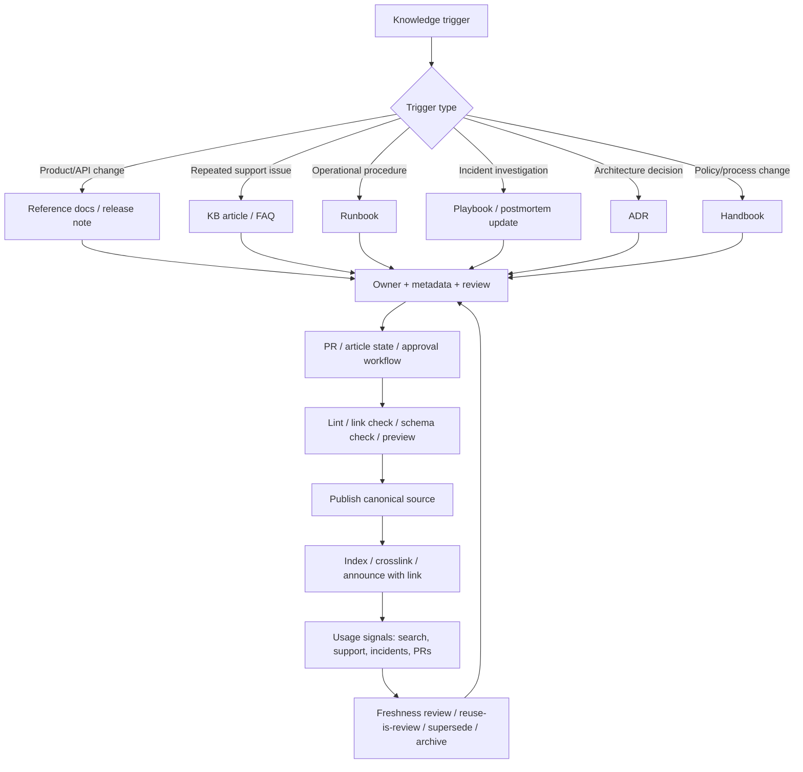

# Frontier Operating Model Research: ドキュメンテーション・ナレッジ管理（Layers 25）

生成日: 2026-05-13  
対象レイヤー: 25  
指示書タイトルの推奨単位: ドキュメンテーション・ナレッジ管理  
主なサブテーマ: reference docs、handbooks、runbooks、ADR、knowledge base、taxonomy、検索性、更新フロー  
調査範囲: 公開情報のみ。公式ドキュメント、標準・実務ガイド、OSS/コミュニティ運用文書、公開ナレッジ管理手法、公開された運用ベストプラクティスを優先。

---

## 1. Executive Summary

この単位で模倣すべき frontier pattern は、単なる「文書作成」ではなく、**組織・プロダクト・運用の意思決定を、発見可能で、所有者が明確で、更新可能で、利用行動に組み込まれた知識システムへ変換すること**である。

先端組織・標準・OSSコミュニティに共通する設計原理は次の 7 点に集約される。

1. **Single Source of Truth を明示する。** GitLab は Handbook を「会社をどう運営するかの central repository」と位置付け、変更提案を merge request で受け付ける。さらに TeamOps では、方針・目標・ワークフロー・手順・価値観を SSoT に構造化し、「latest version」ではなく「the version」を作ると説明している。[^gitlab-handbook][^gitlab-shared-reality]
2. **文書をコードと同じ運用対象にする。** Write the Docs の Docs as Code は、issue tracker、Git、Markdown、code review、automated tests を使う考え方として整理されている。GitHub Docs、Microsoft Learn、Kubernetes docs、Backstage TechDocs も、Git/GitHub、PR、lint、Markdown、リポジトリ内ドキュメントを組み合わせている。[^wtd-docs-as-code][^github-contrib][^github-linter][^microsoft-git][^kubernetes-content][^backstage-techdocs]
3. **ドキュメント種別をユーザーの質問タイプで分ける。** Diátaxis は tutorials、how-to guides、technical reference、explanation の 4 類型を、ユーザーの 4 つのニーズに対応させる。これは reference docs と handbook / runbook / ADR / KB を混在させないための分類基盤になる。[^diataxis]
4. **運用手順は runbook / playbook として、中央保管・所有者・エスカレーション・例外・自動化余地まで含める。** AWS Well-Architected は、runbook を特定成果を達成する手順、playbook をインシデント調査・影響把握・根因特定のステップガイドと定義し、中央保管、頻繁な更新、必要ツール・権限・例外・エスカレーション、成熟時の自動化を求めている。[^aws-runbook][^aws-playbook]
5. **意思決定は ADR として append-only に残す。** Microsoft Azure Well-Architected は ADR を、アーキテクチャがなぜ現在の形になったかの記録とし、受理済み記録を戻って編集せず、決定が変わったら新しい記録で supersede してリンクすることを推奨している。GOV.UK は ADR を visibility、traceability、strategic alignment のための枠組みにし、決定レベルとエスカレーション基準まで定義している。[^microsoft-adr][^govuk-adr]
6. **Knowledge base は業務フロー内で作り、利用時に改善する。** KCS は、ナレッジを日々のサービス業務に組み込み、KCS article が requestor の問題、環境、解決策、responder の経験を捕捉し、利用・再利用を通じて改善され続ける「reuse is review」を中核に置く。[^kcs-guide][^kcs-article]
7. **検索性は後付けの検索窓ではなく、taxonomy、metadata、canonical link、構造化データ、所有者メタデータ、サイト分析の組み合わせで作る。** Backstage Software Catalog は software ecosystem の ownership と metadata を中央管理し、Search は Backstage 内の情報発見を担う。Google Search Central は、検索エンジンとユーザーが内容を理解しやすい構造、structured data、Search Console による計測を推奨する。[^backstage-catalog][^backstage-search][^google-seo][^google-structured-data][^google-search-console]

このレイヤーの Clone Spec は、**ドキュメントを “content inventory” としてではなく “decision memory + operational interface” として扱う**べきである。文書は、一次的には読者への説明だが、運用上は「誰が何を決めたか」「どの手順で実行するか」「どの版が正か」「どの情報を信じてよいか」「いつ更新すべきか」を制御するシステムである。

---

## 2. Layer Registry

| layer_id | layer_name_ja | cluster | definition | decision_question | decision_object | 主な成果物 |
|---|---|---|---|---|---|---|
| 25.01 | ドキュメンテーション・システム | Documentation / Developer Experience / Operations | プロダクト・業務・運用・設計に関する知識を、参照可能・検証可能・更新可能な文書成果物に変換するレイヤー。 | どの知識を reference docs、handbook、runbook、playbook、ADR、FAQ、KB article に分解し、どの品質基準・所有者・公開範囲・更新サイクルで維持するか。 | 文書種別、文書構造、所有者、版、公開範囲、更新条件、品質基準。 | reference docs、style guide、content model、runbook、playbook、ADR、handbook、contributor guide。 |
| 25.02 | ナレッジ管理・検索性 | Knowledge Management / Information Architecture / Findability | 組織内外の知識資産を、発見・再利用・更新・廃止できるようにする分類、メタデータ、検索、ナレッジライフサイクルのレイヤー。 | どの知識をどこに保管し、どの taxonomy・metadata・検索面・利用シグナル・更新フローで「正しい答え」に到達させるか。 | knowledge object、taxonomy、canonical source、search index、owner、freshness state、usage feedback。 | knowledge base、taxonomy、metadata schema、search analytics、content health dashboard、source catalog。 |

### 2.1 統合 Decision Question

世界トップの主体は、reference docs、handbooks、runbooks、ADR、knowledge base をどのように分類・所有・公開・検索・更新し、利用者が「正しい答え」「現在有効な手順」「意思決定の理由」に最短で到達できるようにしているか。

---

## 3. Source Strategy and Evidence Tiers

この調査では、次の source family を優先した。

| family | 主用途 | 採用例 |
|---|---|---|
| 公式運用文書 | 実際の更新フロー、所有者、レビュー、lint、versioning、公開範囲を観測する | GitHub Docs contributing、Kubernetes SIG Docs、GitLab Handbook、Microsoft Learn contributor guide |
| 標準・実務フレームワーク | taxonomy、文書種別、KB lifecycle、incident response、ADR の規範を抽出する | Diátaxis、KCS、NIST SP 800-61r3、AWS Well-Architected、GOV.UK ADR、Microsoft ADR |
| 実行可能成果物 | docs-as-code、API reference、OpenAPI、catalog metadata、search index の実装面を検証する | Backstage TechDocs / Catalog / Search、OpenAPI、Stripe API Reference |
| failure / anti-pattern evidence | drift、重複、muscle memory、alert noise、stale content、heavy governance を抽出する | AWS anti-patterns、Kubernetes dual-sourced content、GitHub expiring content、Google SRE incident guide、Thoughtworks architecture advice process |

---

## 4. Frontier Exemplars and Candidate Scoring

スコアは RESEARCH.md の `Performance / Adoption / Artifact Richness / Peer Validation / Recency / Transferability / Failure Evidence` の軸を簡略化し、公開証拠の厚みと移植可能性を重視した相対評価である。

| Rank | Candidate | Score | Evidence tier | 選定理由 | 主な移植対象 |
|---:|---|---:|---|---|---|
| 1 | GitLab Handbook / TeamOps | 95 | T3/T2 | Handbook を会社運営の central repository、SSoT、public-by-default、handbook-first として運用し、MR・issue・content owner を伴う。 | handbook、SSoT、非同期組織、更新文化 |
| 2 | GitHub Docs | 92 | T3/T2 | OSS repository、public/private sync、PR、style guide、content linter、versioning、expiration tag を公開している。 | docs-as-code、lint、versioning、contribution workflow |
| 3 | Kubernetes SIG Docs | 90 | T3/T2 | SIG Docs charter、content guide、style guide、release-cycle docs freeze、website repository、localization staleness warning を公開している。 | OSS docs governance、release-aligned docs、canonical-source policy |
| 4 | AWS Well-Architected Ops runbooks/playbooks | 88 | T0/T3 | runbook/playbook を明確に区別し、中央保管、所有者、権限、例外、検証、自動化、anti-pattern を定義している。 | runbook/playbook library、operations documentation |
| 5 | KCS v6 / Consortium for Service Innovation | 87 | T0/T3 | KB をサービス業務に統合し、reuse is review、article state、self-service findability を規定している。 | support KB、knowledge article lifecycle、self-service success |
| 6 | Backstage TechDocs / Software Catalog / Search | 85 | T2/T3 | docs-like-code、software ownership metadata、central catalog、enterprise search を統合する実装モデル。 | platform engineering、internal developer portal、metadata-driven search |
| 7 | Diátaxis | 83 | T0/T3 | tutorials / how-to / reference / explanation に基づく content architecture を提供する。 | content taxonomy、information architecture |
| 8 | Microsoft Learn / Style Guide / ADR | 82 | T3/T2 | reference docs と code examples の定義、Git/GitHub workflow、PR publish、ADR append-only model を公開。 | reference docs、contributor workflow、ADR lifecycle |
| 9 | GOV.UK ADR Framework | 80 | T0/T3 | ADR を decision level、stakeholder、approval、escalation、cross-government alignment に接続。 | decision governance、公共・大規模組織の ADR |
| 10 | Stripe Docs / OpenAPI | 78 | T2/T0 | API reference、changelog、OpenAPI spec、SDK の連動により reference docs を executable artifact 化している。 | API reference、schema-driven docs、developer docs |
| 11 | Google Search Central / Search Console | 76 | T0/T3 | searchability、structured data、indexing、query analytics、quality questions を提供。 | external discoverability、structured metadata、search analytics |

---

## 5. Evidence Map

| claim_id | Claim | decision_model_field | confidence | Evidence |
|---|---|---|---|---|
| C-25.01-001 | 優れた handbook は、会社・チーム運営の SSoT として機能し、diff / MR / issue で変更可能にする。 | core_philosophy / update_flow | A | GitLab Handbook は central repository、world-open、MR/issue feedback を明記。GitLab TeamOps は SSoT と handbook-first を明記。[^gitlab-handbook][^gitlab-shared-reality] |
| C-25.01-002 | 先端 docs operation は docs-as-code を採用し、Git、Markdown、PR、lint、automated checks を使う。 | operating_model / controls | A | Write the Docs、GitHub Docs linter、Microsoft Learn Git/GitHub、Backstage TechDocs、Kubernetes website repo。[^wtd-docs-as-code][^github-linter][^microsoft-git][^backstage-techdocs][^kubernetes-content] |
| C-25.01-003 | reference docs は encyclopedia 型の仕様説明と code examples を分け、API schema や OpenAPI と連動させる。 | artifacts / technical_spec | A | Microsoft Style Guide は reference docs と code examples を developer documentation の基礎とする。OpenAPI は HTTP API の標準インタフェース記述。Stripe は REST API reference と changelog を公開。[^microsoft-dev-content][^openapi][^stripe-api][^stripe-changelog] |
| C-25.01-004 | runbook は成果を達成する手順、playbook は調査・影響把握・根因特定の手順として分けるべきである。 | taxonomy / decision_rules | A | AWS Well-Architected の runbook/playbook best practices。[^aws-runbook][^aws-playbook] |
| C-25.01-005 | runbook/playbook は中央保管、所有者、必要ツール・権限、例外、エスカレーション、更新、検証、自動化の対象にする。 | controls / operating_model | A | AWS runbook/playbook implementation guidance。[^aws-runbook][^aws-playbook] |
| C-25.01-006 | on-call / incident documentation は、playbook の存在だけでは不足し、alert が actionable で、on-caller が playbook と training を認識している必要がある。 | failure_modes / controls | A | Google SRE Incident Management Guide。[^google-sre-incident] |
| C-25.01-007 | ADR は重要な設計判断の context、options、decision、tradeoffs、status、confidence、consequences を記録し、変更時は supersede する。 | artifacts / lifecycle | A | Microsoft ADR、GOV.UK ADR Framework、ADR GitHub organization、Thoughtworks ADR。[^microsoft-adr][^govuk-adr][^adr-github][^thoughtworks-adr] |
| C-25.01-008 | 大規模組織の ADR は、チーム・プログラム・部門・横断組織の decision level と escalation criteria に接続すべきである。 | approval / governance | A | GOV.UK ADR Framework。[^govuk-adr] |
| C-25.02-001 | knowledge base は、業務フローで作成・再利用・改善される living system として扱う。 | lifecycle / metrics | A | KCS v6 Practices Guide、KCS article。[^kcs-guide][^kcs-article] |
| C-25.02-002 | self-service success の findability は、context、structure、rich environment statements に依存する。 | searchability / taxonomy | A | KCS Self-Service Success。[^kcs-findability] |
| C-25.02-003 | docs taxonomy は tutorials / how-to / reference / explanation の 4 類型を基礎にすると、読者の質問タイプに対応しやすい。 | taxonomy / content_model | A | Diátaxis。[^diataxis] |
| C-25.02-004 | internal developer portal では、ドキュメントを software ownership metadata と接続すると、検索・責任分界・保守性が上がる。 | metadata / owner_model | A/B | Backstage Software Catalog、TechDocs、Search。[^backstage-catalog][^backstage-techdocs][^backstage-search] |
| C-25.02-005 | external searchability は、ユーザー向け品質、クロール可能性、structured data、Search Console による計測を組み合わせる。 | searchability / metrics | A | Google SEO Starter Guide、structured data、Search Console。[^google-seo][^google-structured-data][^google-search-console] |
| C-25.02-006 | stale content の主要因は、重複掲載、所有者不明、期限切れコンテンツ、release cadence との非同期化である。 | failure_modes | B | Kubernetes dual-sourced content、GitHub expiring content、Kubernetes docs freeze、AWS runbook drift。[^kubernetes-content][^github-expiring][^kubernetes-release][^aws-runbook] |
| C-25.02-007 | frontier docs operation は、release lifecycle に docs deadline / docs freeze / release notes を埋め込む。 | cadence / controls | A | Kubernetes v1.36 release schedule。[^kubernetes-release] |

---

## 6. Core Philosophy

### 6.1 Knowledge as Operational Interface

先端的なドキュメンテーション・ナレッジ管理は、「読むための文書」ではなく、次の 4 つの interface を同時に作る。

| interface | 目的 | 例 |
|---|---|---|
| User interface | 利用者が機能・手順・判断基準を理解する | reference docs、how-to、tutorial、FAQ |
| Operational interface | チームが同じ手順で同じ結果を得る | runbook、playbook、incident guide、release note |
| Decision interface | なぜ現在の設計・方針なのかを再検討できる | ADR、RFC、decision log、architecture advice process |
| Retrieval interface | 必要情報を検索・分類・所有者経由で発見する | taxonomy、metadata、software catalog、search index、KB article |

### 6.2 Single Source of Truth, Not Single Tool

SSoT は「すべてを 1 ツールへ入れる」ことではない。GitLab TeamOps も、各チームが性質に応じて異なる medium を SSoT として選びうるが、その SSoT を透明に共有し、必要に応じて crosslink することを求める。したがって Clone Spec では、単一ツール導入ではなく、**source-of-truth registry** を作る。

```yaml
knowledge_object:
  id: RUN-OPS-001
  title: Production rollback runbook
  type: runbook
  canonical_source: git://org/platform-docs/runbooks/rollback.md
  public_scope: internal
  owner: SRE Team
  reviewers: [Platform Lead, Security DRI]
  lifecycle_state: current
  last_validated_at: 2026-04-18
  review_cycle: quarterly
  expires_at: null
  product_version: service-api@2026.04
  related_alerts: [ALERT-API-5XX, ALERT-DEPLOY-FAILED]
  related_adrs: [ADR-012, ADR-021]
  tags: [rollback, deployment, production, sre]
  search_keywords: [rollback, revert, deploy failure, production incident]
```

### 6.3 “Answer with a Link” Requires “Update with a Diff”

GitLab は handbook-first を「まず SSoT に記録し、その後に共有する」文化として説明する。これを再現するには、チャット・会議・口頭説明を禁止するのではなく、**チャットや会議で発生した有用な説明を、リンク可能な文書へ還流する強制関数**を作る必要がある。更新は口頭アナウンスではなく diff、PR、issue、changelog、ADR supersession、KB reuse/review に接続する。

---

## 7. Decision Model

| フィールド | Clone Spec |
|---|---|
| Inputs | product/version changes、incident patterns、support tickets、customer questions、search queries、onboarding questions、architecture decisions、release milestones、compliance requirements、broken links、stale page reports、analytics、internal chat/meeting recurring questions |
| Decision Object | ある知識を、どの doc type にし、どこを canonical source にし、誰が owner となり、どの検索・更新・廃止ルールで維持するか。 |
| Criteria | user task fit、risk criticality、frequency of reuse、time sensitivity、decision reversibility、operational impact、public/internal scope、need for versioning、need for automation、findability、translation/localization risk |
| Priorities | 1. canonical source 明示、2. owner 明示、3. reader task に合う content type、4. release/change workflow への統合、5. search metadata、6. stale/expiry control、7. usage-based improvement |
| Prohibitions | owner なし文書、dual-sourced content の無断複製、chat-only policy、手順の口伝、承認済み ADR の後編集、期限切れ文書の無タグ公開、runbook の未検証公開、third-party docs の不要な転載 |
| Thresholds | high-risk operation は runbook 必須、architecturally significant decision は ADR 必須、new feature は release 前 docs review 必須、top 20 search-no-result query は月次 review、stale > 180日 は owner review、critical runbook は四半期演習、public docs は broken link 0 critical |
| Owners | Head of Documentation / Content Design、Knowledge Manager、Docs Platform Owner、Product Docs Owner、Service Owner、SRE Owner、Architecture DRI、Support Knowledge Lead、Search / IA Owner |
| Reviewers | PM、Engineering Lead、SRE、Security、Support、Legal/Compliance、Localization Lead、Accessibility reviewer、API/schema owner |
| Cadence | PR ごとの review、release cycle docs freeze、月次 search/query review、四半期 stale audit、incident 後 runbook/playbook update、architecture decision 発生時 ADR、半期 taxonomy review |
| Interfaces | docs site、developer portal、software catalog、KB portal、Git repository、issue tracker、PR workflow、Search Console/internal search analytics、incident management system、CI/linter、schema registry |
| Controls | content linter、style guide、frontmatter metadata、ownership registry、expiry tags、broken-link checker、schema diff、docs-required release gate、KB article state、ADR status、runbook validation checklist、search analytics dashboard |
| Exceptions | legal/private information、security-sensitive exploit detail、regulated disclosure、temporary incident comms、product beta docs、locale lag、third-party canonical docs |
| Metrics | search success rate、zero-result query rate、self-service deflection、KB reuse/improve/create ratio、time-to-first-answer、docs PR cycle time、stale-page count、runbook validation pass rate、MTTR with playbook、ADR coverage、broken links、translation lag |

---

## 8. Operating Model

### 8.1 Role Model

| Role | Responsibility | Required authority |
|---|---|---|
| Documentation DRI | content model、style guide、docs quality、publication workflow の owner | docs site / docs repo merge authority |
| Knowledge Manager | KB lifecycle、taxonomy、search analytics、content health、self-service success の owner | KB article states / taxonomy governance |
| Product Docs Owner | feature docs、reference docs、release notes、versioned docs の owner | product release gate への参加 |
| Service / SRE Owner | runbook、playbook、incident docs、postmortem knowledge の owner | incident process / alert routing への変更権限 |
| Architecture DRI | ADR template、decision log、escalation criteria の owner | architecture advice / review forum の運用権限 |
| Docs Platform Owner | static site、search index、CI lint、metadata schema、analytics の owner | platform / CI / search system の変更権限 |
| Support Knowledge Lead | KCS adoption、article quality、reuse/review、self-service conversion の owner | support workflow / KB tooling の変更権限 |
| Localization Lead | locale freshness、source/translation lag、translation memory の owner | locale publication / stale warning authority |

### 8.2 Process Model



### 8.3 Document Type Decision Table

| Trigger | Use this artifact | Do not use | Required fields |
|---|---|---|---|
| A user asks “what is every parameter / field / method?” | Reference docs | Blog post / handbook page | version, schema/source, examples, errors, changelog, owner |
| A user asks “how do I accomplish X?” | How-to guide | API reference only | prerequisites, steps, expected result, troubleshooting, product version |
| A new hire asks “how does this team operate?” | Handbook | Private slide deck | policy/process, DRI, effective date, related systems, escalation |
| On-call needs to perform a repeatable operation | Runbook | Chat instructions | desired outcome, steps, tools, permissions, owner, last validated, escalation |
| On-call needs to investigate an incident | Playbook | Runbook only | symptoms, discovery steps, impact scope, comms plan, escalation, companion runbooks |
| A significant architecture choice is made | ADR | Meeting minutes only | context, options, decision, tradeoffs, consequences, status, consulted stakeholders, supersedes |
| A support issue recurs or is solved once and reusable | KB article | Personal note | issue in requestor words, environment, resolution, cause/diagnosis, visibility, article state |
| A change affects docs discoverability or classification | Taxonomy / metadata update | Page rename only | category, tags, redirects, canonical URL, related docs, search keywords |

---

## 9. Technical / Business Specification

### 9.1 Reference Docs

Frontier reference docs are schema-backed, version-aware, example-rich, and machine-readable where possible.

Minimum spec:

```yaml
reference_doc:
  type: reference
  owner: API/SDK owner
  source_of_truth: openapi/proto/schema/docs-repo
  version_scope: product or API version
  required_sections:
    - overview
    - authentication_or_permissions
    - object_model
    - parameters_or_fields
    - request_examples
    - response_examples
    - error_model
    - rate_limits_or_constraints
    - changelog_or_deprecation_notes
    - SDK/code_examples
  controls:
    - schema_diff_check
    - examples_compile_or_execute
    - link_check
    - version_frontmatter
    - freshness_review
```

Evidence basis:

- Microsoft は developer documentation の基礎を reference documentation と code examples として説明する。[^microsoft-dev-content]
- OpenAPI は HTTP API の standard interface description であり、ソースコードや追加文書なしに capabilities を理解するための仕様である。[^openapi]
- Stripe は REST API reference、API changelog、OpenAPI spec、SDKs を公開し、reference docs を schema / SDK / changelog と接続している。[^stripe-api][^stripe-changelog][^stripe-openapi][^stripe-sdks]

### 9.2 Handbooks

Handbook は、会社・チーム・プロダクト運営の “operational constitution” として設計する。

Minimum spec:

```yaml
handbook_page:
  type: handbook
  owner: function DRI
  maintainers: [named people or role]
  scope: company/team/function/process
  effective_date: 2026-05-13
  public_scope: public/internal/restricted
  canonical_source: docs repo path
  required_sections:
    - purpose
    - policy_or_process
    - roles_and_responsibilities
    - decision_rules
    - escalation
    - related_pages
    - change_history
  update_flow:
    - open issue or MR
    - owner review
    - merge
    - announce by link
```

Evidence basis:

- GitLab Handbook は会社運営の central repository であり、世界に公開され、MR/issue で改善を受け付ける。[^gitlab-handbook]
- GitLab は handbook-first によって、プロトコル・更新・解決策・ガイダンスを SSoT に先に文書化し、その後に共有することを求める。[^gitlab-remote]
- TeamOps は SSoT を「version が複数あるのではなく、the version がある」状態として説明し、重複発見時には SSoT へ統合する。[^gitlab-shared-reality]

### 9.3 Runbooks and Playbooks

Runbook と playbook は混同しない。

| Artifact | Primary question | Required design |
|---|---|---|
| Runbook | “特定成果をどう達成するか” | checklist, desired outcome, tools, permissions, error handling, exceptions, escalation, owner, last validated |
| Playbook | “何が起きているかをどう調査するか” | symptoms, investigation path, impact scoping, stakeholder communications, unknown-root-cause escalation, linked runbooks |

Minimum spec:

```yaml
runbook:
  id: RUN-001
  desired_outcome: service rollback completed safely
  owner: SRE team
  last_validated_at: 2026-05-01
  validation_method: peer execution / game day
  tools: [deploy-cli, observability dashboard]
  permissions: [prod-deployer]
  steps: []
  error_handling: []
  escalation: []
  automation_status: manual | semi_automated | automated
```

Evidence basis:

- AWS は runbook を「specific outcome」を達成する step-by-step process とし、中央保管、頻繁な更新、エラー処理、ツール、権限、例外、エスカレーションを求める。[^aws-runbook]
- AWS は playbook を incident investigation の step-by-step guide とし、影響範囲、根因、stakeholder communication、escalation、companion runbook を求める。[^aws-playbook]
- Google SRE は、up-to-date playbooks と training material が incident response を速めるが、on-call がそれを認識していないと効果が低いと述べる。[^google-sre-incident]
- NIST SP 800-61r3 は incident response を CSF 2.0 に統合し、準備・対応・復旧活動の効率と効果を改善するための推奨事項として公開されている。[^nist-800-61r3]

### 9.4 ADR

ADR は「意思決定の監査ログ」であり、設計書や議事録の代替ではない。

Minimum spec:

```yaml
adr:
  id: ADR-023
  title: Use event-driven ingestion for billing ledger updates
  status: proposed | accepted | superseded | rejected
  date: 2026-05-13
  decision_level: team | cross-team | department | enterprise
  context: problem statement and constraints
  architecturally_significant_requirements: []
  options_considered:
    - option
    - tradeoffs
  decision: chosen option
  confidence: high | medium | low
  consequences:
    positive: []
    negative: []
  stakeholders_consulted: []
  supporting_documents: []
  supersedes: null
  superseded_by: null
```

Rules:

- 1 ADR = 1 architecturally significant decision.
- accepted ADR は後から意味を変えず、変更時は新 ADR で supersede する。
- options considered と ruled-out alternatives を書く。
- decision confidence を書く。低確度決定は後日の再検討対象になる。
- decision level と escalation criteria を明示する。

Evidence basis:

- Microsoft は ADR を workload 開始時から維持し、append-only log として受理済み記録を編集せず、新記録で supersede してリンクすることを推奨する。[^microsoft-adr]
- GOV.UK は ADR に title、date、status、context、decision、consequences、stakeholders consulted、supporting documents を含め、決定レベルとエスカレーション基準を定義する。[^govuk-adr]
- Thoughtworks は ADR を evolutionary architecture において将来メンバーと外部監督のために重要な設計判断の context と consequences を残す技法として扱い、source control での保存を推奨する。[^thoughtworks-adr]

### 9.5 Knowledge Base and KCS

Knowledge base は「FAQ の倉庫」ではなく、サービス業務の副産物として増え、利用によって品質が上がるシステムである。

Minimum spec:

```yaml
kb_article:
  id: KB-001234
  state: draft | not_validated | validated | flagged | archived
  audience: internal | customer | partner
  issue_in_requestor_words: "Cannot connect to API after rotating key"
  environment: product version, tenant type, OS/browser, integration type
  resolution: step-by-step fix
  cause_or_diagnosis: root cause or diagnostic logic
  related_cases: []
  related_docs: []
  search_phrases: []
  owner: support knowledge lead
  reuse_count: 0
  last_reused_at: null
  last_improved_at: null
```

Rules:

- case / incident / support response の中で作る。
- 見つからない場合は create、見つかったが不完全なら improve、使えたなら reuse を記録する。
- article quality は SME の事前承認だけでなく、reuse/review と user outcome で見る。
- self-service success は findability、completeness、structure、context の問題として管理する。

Evidence basis:

- KCS は、組織の経験を他者が利用できる形で捕捉し、業務フローの中で reuse / improve / create する考え方を提示する。[^kcs-guide]
- KCS article は requestor の問題、環境、resolution、responder の経験を捕捉し、reuse is review によって改善され続ける。[^kcs-article]
- KCS は self-service の findability を context、structure、rich environment statements によって駆動されるとする。[^kcs-findability]

### 9.6 Taxonomy and Information Architecture

Taxonomy は、部署名やツール名ではなく、読者の質問タイプ、知識の寿命、リスク、変更トリガー、所有者で設計する。

Recommended top-level taxonomy:

| Axis | Values | Purpose |
|---|---|---|
| content_type | tutorial / how-to / reference / explanation / handbook / runbook / playbook / ADR / KB article / release note | reader intent と update workflow を一致させる |
| audience | user / developer / admin / SRE / support / architect / employee / partner | UI、権限、用語、深さを制御 |
| source_of_truth | docs repo / API schema / handbook / KB / catalog / incident system / ADR log | canonical source を明示 |
| freshness_state | current / needs-review / expires-soon / expired / superseded / archived | stale content を制御 |
| risk_level | low / medium / high / regulated / security-sensitive | review / approval / publish scope を制御 |
| owner_type | product / engineering / SRE / support / legal / people / architecture | owner routing |
| lifecycle_trigger | release / incident / support case / architecture decision / policy change / audit | update trigger |
| discoverability | public search / internal search / catalog / alert-linked / case-linked / onboarding | 検索面を制御 |

Evidence basis:

- Diátaxis の 4 分類は docs の content architecture を reader needs に紐づける。[^diataxis]
- Backstage Software Catalog は software ecosystem の ownership と metadata を中央で追跡し、metadata YAML とコードを共存させる。[^backstage-catalog]
- Kubernetes は canonical content へのリンクを優先し、dual-sourced content は stale になりやすいとする。[^kubernetes-content]

### 9.7 Searchability

Searchability は次の 5 層で設計する。

| Layer | Control | Example |
|---|---|---|
| Content quality | original, complete, helpful, people-first | Google content quality questions |
| Information architecture | headings, hierarchy, canonical links, breadcrumbs, related docs | docs site IA, Diátaxis, K8s content guide |
| Metadata | type, audience, owner, tags, version, status, product area | Backstage catalog YAML, docs frontmatter |
| Search index | internal search, developer portal search, external Google Search | Backstage Search, Google Search |
| Analytics feedback | zero-result query, CTR, query-to-doc mapping, Search Console, KB self-service | Search Console, internal search analytics, KCS reuse |

Minimum search spec:

```yaml
search_metadata:
  title: "Rotate API keys"
  short_title: "Rotate keys"
  content_type: how-to
  audience: developer
  product_area: authentication
  tags: [api keys, credentials, security, rotation]
  synonyms: [secret key, access key, token]
  owner: identity-platform-docs
  canonical_url: /docs/security/rotate-api-keys
  related_docs:
    - /docs/api/authentication
    - /docs/runbooks/key-rotation-failure
  structured_data: true
  indexed_by:
    - public_search
    - internal_search
    - developer_portal
```

Evidence basis:

- Google SEO Starter Guide は、検索エンジンが内容を理解し、ユーザーがコンテンツを見つけるための改善を説明する。[^google-seo]
- Google structured data guide は、ページ内容を分類する標準化された形式として structured data を説明し、JSON-LD を大規模運用で維持しやすい選択肢として推奨する。[^google-structured-data]
- Search Console は search traffic、query、index coverage、URL inspection を計測・修正する面を提供する。[^google-search-console]
- Backstage Search は Backstage ecosystem の情報を発見する機能である。[^backstage-search]

### 9.8 Update Flow

Update flow は、文書作成者の善意ではなく、業務イベントに紐づいた trigger-driven workflow にする。

| Trigger | Required action | Gate / control |
|---|---|---|
| Product feature release | reference docs / how-to / release note update | release checklist, docs freeze, version frontmatter |
| API schema change | reference docs + SDK examples + changelog update | schema diff, OpenAPI/proto sync, examples test |
| Incident / outage | playbook update, runbook correction, KB article, postmortem link | incident close checklist |
| Support case solved repeatedly | KB create/improve/reuse | KCS workflow, article state |
| Architecture decision | ADR create/accept/supersede | architecture advice/review, ADR status |
| Process/policy change | handbook update | MR/issue, DRI approval, announce by link |
| Expiring / time-bound content | expiry tag and review | linter/metadata alert |
| Localization lag | source/translation diff warning | locale freshness badge |

Evidence basis:

- GitHub Docs は content linter が style rules を enforce し、errors は commit や CI を止める。[^github-linter]
- GitHub Docs は versioning を YAML frontmatter と Liquid operators で単一ソース化する。[^github-versioning]
- GitHub Docs の style guide は期限切れになる content を原則避け、必要なら expiration tag を content linter で管理すると説明する。[^github-expiring]
- Kubernetes v1.36 release schedule には docs deadline、docs freeze、release notes complete が明示されている。[^kubernetes-release]
- Kubernetes 日本語 docs は英語版より古い場合に stale warning を表示する。[^kubernetes-ja-stale]

---

## 10. Metrics

### 10.1 Core Metrics

| Metric | Definition | Why it matters | Suggested target |
|---|---|---|---|
| Search success rate | 検索後に有効ドキュメントを開き、再検索/問い合わせなしで解決した比率 | findability の最終成果 | > 80% for top queries |
| Zero-result query rate | internal search で結果なしの query 比率 | taxonomy / synonym gap | < 5% monthly |
| Top query freshness | top 100 query に紐づく pages の last_validated が閾値内 | 利用頻度の高い知識を優先更新 | top pages < 90 days review |
| Docs PR cycle time | docs PR open → merge | update flow の摩擦 | median < 5 business days |
| Docs release gate pass rate | release 前に必要 docs が完了した比率 | product change と docs の同期 | 100% for GA |
| Stale content count | expired / needs-review / ownerless pages | knowledge debt | trend down |
| Broken link critical count | critical docs の broken links | trust / discoverability | 0 critical |
| KB reuse ratio | reused articles / created articles | KCS adoption | increases over baseline |
| KB improve-on-reuse rate | article reuse 時に改善された比率 | reuse is review | tracked by team |
| Self-service deflection | KB / docs により support case を回避した推定数 | business value | team baseline + growth |
| Runbook validation pass rate | 演習で手順が成功した比率 | operational readiness | > 95% critical runbooks |
| Playbook-linked alert coverage | alert に playbook link がある比率 | incident speed | > 90% actionable alerts |
| MTTR with playbook | playbook 利用時の mean time to recover | incident outcome | improve trend |
| ADR coverage | significant architecture change のうち ADR がある比率 | decision memory | 100% high impact |
| Superseded ADR linkage | supersede された ADR が相互リンクされている比率 | decision traceability | 100% |
| Localization lag | source update から locale update までの時間 | translated docs trust | policy-specific |

### 10.2 Dashboard Views

1. **Executive KM view**: self-service deflection、stale content、search success、high-risk runbook validation、ADR coverage。
2. **Docs platform view**: PR cycle time、lint failure、broken links、schema drift、top outdated pages。
3. **Support KB view**: article create/reuse/improve、zero-result queries、case-to-article coverage、article state distribution。
4. **SRE operational docs view**: playbook-linked alerts、runbook validation、incident docs updates after closure、automation status。
5. **Architecture governance view**: proposed/accepted/superseded ADRs、decision lead time、stakeholder coverage、escalation counts。

---

## 11. Failure Modes

| failure_id | Failure mode | Symptom | Evidence | Prevention |
|---|---|---|---|---|
| F-001 | Knowledge silo / chat-only knowledge | 「誰かに聞かないと分からない」、同じ質問が繰り返される | GitLab は issue tracker / handbook-first を chat・meeting・email より優先する。[^gitlab-remote] | answer-with-link、meeting-to-doc action item、chat retention / docs-first ritual |
| F-002 | Runbook drift | 手順が実システム変更に追随せず、on-call が別手順を使う | AWS は runbook drift out of sync を anti-pattern とする。[^aws-runbook] | last_validated、change-management hook、game day、owner alert |
| F-003 | Muscle memory operations | 個人ごとに手順が違い、引き継ぎ不能 | AWS は memory / institutional knowledge 依存を anti-pattern とする。[^aws-runbook][^aws-playbook] | checklist runbook、peer validation、automation |
| F-004 | Playbook not actionable | alert が noisy / playbook に接続せず、調査が遅れる | Google SRE は alert は actionable であるべきとし、playbook と training 認知を求める。[^google-sre-incident] | alert-to-playbook mapping、SLO-based alerting、on-call training |
| F-005 | Dual-sourced content | 2箇所に同じ説明があり、片方が stale になる | Kubernetes は dual-sourced content は保守負荷が高く stale になりやすいとする。[^kubernetes-content] | canonical link、transclusion、do-not-copy policy |
| F-006 | Expiring content unmanaged | 期限切れイベント/ベータ/キャンペーン説明が残り続ける | GitHub Docs は expiring content を原則避け、必要なら linter で expiration tag 管理。[^github-expiring] | expiry metadata、scheduled review、auto-archive |
| F-007 | ADR as editable wiki page | 過去の判断理由が書き換わり、なぜ変わったかが不明 | Microsoft は ADR を append-only log とし、変更時は supersede を推奨。[^microsoft-adr] | immutable accepted ADR、superseded_by link |
| F-008 | Heavy architecture board bottleneck | 決定待ちで delivery が遅れ、現場が迂回する | Thoughtworks は従来型 Architecture Review Board が flow を阻害し低 performance と相関すると説明し、advice process を代替案に挙げる。[^thoughtworks-advice] | decision level、advice process、escalation criteria |
| F-009 | Search without taxonomy | 検索窓はあるが結果が多すぎる/少なすぎる | KCS は findability が context、structure、rich environment statements によるとする。[^kcs-findability] | controlled taxonomy、synonyms、metadata、search analytics |
| F-010 | Translation/localization staleness | locale page が古く、ユーザーが誤った手順を使う | Kubernetes ja docs は英語版より古い可能性がある旨を表示。[^kubernetes-ja-stale] | source-locale diff、stale warning、translation SLA |

---

## 12. Anti-patterns

1. **“Wiki exists, therefore KM exists”**: wiki の存在と知識管理は別物。owner、state、search analytics、update trigger がなければ knowledge graveyard になる。
2. **“All docs in one hierarchy”**: reference、how-to、handbook、runbook、ADR、KB article を同じ階層に混ぜると、読者の質問タイプと文書構造がずれる。
3. **“SME approval only”**: ナレッジ品質を SME の事前承認だけで管理すると、利用時の改善が止まる。KCS 型に reuse / improve を入れる。
4. **“Docs after release”**: docs を release 後に回すと、product truth と docs truth が分離する。Kubernetes のように docs deadline / freeze を release cycle に組み込む。
5. **“Runbook is a Word document”**: 形式より、last validated、owner、permissions、error handling、companion automation が重要。
6. **“ADR is a meeting memo”**: ADR は decision record。議論ログではなく、context、options、decision、consequences、status、supersession を残す。
7. **“Search is solved by semantic search alone”**: semantic search だけでは owner、version、status、risk、canonical が分からない。metadata と lifecycle state が必要。
8. **“Public by default without classification”**: 透明性は重要だが、security-sensitive、legal、regulated、personal data は例外ルールが必要。
9. **“Duplicate for convenience”**: 便利だから同じ内容をコピーすると stale risk が上がる。canonical link / embed / transclusion / summary + link にする。
10. **“No stale warning”**: 古い locale、beta docs、deprecated feature docs は、明示的に警告しなければ信頼を壊す。

---

## 13. Maturity Model

| Level | Name | Criteria |
|---:|---|---|
| 0 | 未整備 / Oral Knowledge | 文書は個人ノート・チャット・口頭に分散。owner なし。検索不能。runbook/ADR/KB の区別なし。 |
| 1 | Repository Exists | wiki または docs site はあるが、分類・所有者・更新サイクルが不明。古い文書が混在。 |
| 2 | Documented and Owned | 主要文書に owner、type、last updated、review cadence がある。reference docs、handbook、runbook、ADR、KB を区別。 |
| 3 | Docs-as-Code / Workflow Integrated | Git/PR/review/lint/link check/versioning を導入。release、incident、support case、architecture decision が文書更新 trigger になる。 |
| 4 | Measured Knowledge System | search analytics、KB reuse、stale pages、runbook validation、ADR coverage、docs PR cycle time を dashboard 化。トップ query と incident から継続改善。 |
| 5 | Self-Healing / Frontier | schema diff・release gate・incident close・support workflow・catalog metadata・search analytics が自動連携。文書は owner に自動通知され、critical runbook は演習・自動化され、ADR は decision graph として参照される。 |

---

## 14. Clone Implementation Guide

### 14.1 0–30 days: Inventory and Canonicalization

Deliverables:

- `source_catalog`: 既存 docs / wiki / KB / runbook / ADR / handbook / API reference の棚卸し。
- `doc_type_taxonomy`: Diátaxis + handbook/runbook/playbook/ADR/KB の分類。
- `owner_registry`: 各文書の owner / reviewer / escalation owner。
- `canonical_source_policy`: 重複禁止、canonical link、転載・要約ルール。
- `metadata_schema`: type、owner、audience、version、status、last_validated、review_cycle、related_docs、tags。

Actions:

1. top 100 accessed pages、top 100 search queries、top 50 support issues、last 20 incidents、last 20 architecture decisions を収集する。
2. すべての文書に `type / owner / source_of_truth / status / last_validated` を付ける。
3. owner 不明文書を `orphaned` として隔離する。
4. 重大運用手順を runbook/playbook に分解する。
5. 重要設計判断のうち ADR がないものを retrospective ADR として作る。

### 14.2 31–60 days: Workflow Integration

Deliverables:

- Git-based docs repository or docs platform workflow。
- PR review checklist。
- content linter / style guide / link checker。
- runbook validation template。
- ADR template and decision-level matrix。
- KB article workflow with create/reuse/improve。

Actions:

1. release checklist に docs-required gate を入れる。
2. incident close checklist に runbook/playbook/KB update を入れる。
3. architecture review / advice process に ADR create/accept/supersede を入れる。
4. support workflow に KCS create/reuse/improve を入れる。
5. top 20 zero-result queries に synonym / metadata / new content 対応を行う。

### 14.3 61–90 days: Measurement and Automation

Deliverables:

- Knowledge dashboard。
- Search analytics review cadence。
- stale content bot or notification。
- runbook automation backlog。
- ADR graph / decision log index。
- content health report。

Actions:

1. stale > 180日、ownerless、expired、broken-link critical の dashboard を出す。
2. alert-to-playbook coverage を測る。
3. top support cases の self-service deflection を測る。
4. critical runbook を game day で検証する。
5. OpenAPI/proto/schema diff から reference docs drift を検出する。
6. ADR status と supersession link を index 化する。

### 14.4 Ongoing Operating Cadence

| Cadence | Activity |
|---|---|
| Weekly | docs PR review、broken link/lint review、top failed searches triage |
| Monthly | top query / top KB reuse / stale high-traffic pages review |
| Quarterly | team handbook audit、critical runbook validation、taxonomy review |
| Per release | docs deadline、docs freeze、release notes、reference docs diff |
| Per incident | playbook/runbook correction、KB article update、postmortem link |
| Per architecture decision | ADR create / accept / supersede / stakeholder consultation |
| Semiannual | knowledge system maturity review and owner audit |

---

## 15. Pattern Library

| pattern_id | pattern_name | layer_scope | pattern_type | description | preconditions | tradeoffs | confidence |
|---|---|---|---|---|---|---|---|
| P-25.01-001 | Handbook-first SSoT | 25.01,25.02 | operating_model | 方針・手順・組織情報を handbook に先に記録し、共有はリンクで行う。 | transparent culture、owner registry、PR/MR workflow | 書く習慣がない組織では初期摩擦が大きい | A |
| P-25.01-002 | Docs-as-code Quality Gate | 25.01 | control | Markdown/Git/PR/lint/link check/preview で docs を product workflow に接続する。 | docs repo、CI、style guide | 非技術部門には学習コスト | A |
| P-25.01-003 | Release-Integrated Docs Freeze | 25.01 | cadence | release cycle に docs deadline / docs freeze / release note complete を入れる。 | release management process | 急な仕様変更時に例外運用が必要 | A |
| P-25.01-004 | Runbook / Playbook Split | 25.01 | decision_rule | 作業実行手順と調査手順を分け、playbook から companion runbook へ接続する。 | incident management process | 小規模では過剰に見える可能性 | A |
| P-25.01-005 | Append-only ADR | 25.01 | control | accepted ADR を編集せず、新 ADR で supersede して判断履歴を保存する。 | ADR template、decision trigger | 既存意思決定の retroactive 整備が必要 | A |
| P-25.02-001 | Reuse-is-Review KB | 25.02 | operating_model | KB article を利用時に検証・改善する。 | support workflow integration | article state 管理が必要 | A |
| P-25.02-002 | Metadata-driven Search | 25.02 | technical_spec | content type、audience、owner、status、version、tags、synonyms を検索 index に渡す。 | metadata schema、search backend | metadata maintenance burden | A/B |
| P-25.02-003 | Canonical-over-Copy | 25.02 | anti_pattern/control | 重複掲載を避け、canonical link / embed / transclusion を使う。 | source catalog、redirect policy | 読者が別サイトへ遷移する負担 | A |
| P-25.02-004 | Stale Warning and Expiry Tag | 25.02 | control | 期限切れ・翻訳遅れ・deprecated docs を警告・lint・review queue へ入れる。 | lifecycle metadata | 表示上の信頼低下を短期的に招く | A |
| P-25.02-005 | Software Catalog + TechDocs | 25.02 | technical_spec | ドキュメントを code と共存させ、software ownership metadata と検索に接続する。 | developer portal、catalog YAML | 非ソフトウェア文書には別モデルが必要 | A/B |

---

## 16. Validation Queries

追加検証・反証検索用のクエリ束。

```text
# Handbook / SSoT
site:handbook.gitlab.com "single source of truth" "handbook-first"
site:handbook.gitlab.com "View page source" "Edit this page" "Maintainers"
"GitLab Handbook" "merge request" "issue" "outdated"

# Docs-as-code / contribution workflow
site:docs.github.com/en/contributing "content linter" "versioning"
site:docs.github.com/en/contributing "expiring content"
site:learn.microsoft.com/en-us/contribute/content "pull request" "Microsoft Learn"
site:kubernetes.io/docs/contribute "SIG Docs" "release cycle"

# Runbooks / playbooks / incident docs
site:docs.aws.amazon.com/wellarchitected "Use runbooks" "Use playbooks"
site:sre.google "playbooks" "incident response" "oncall"
site:csrc.nist.gov/pubs/sp/800/61/r3/final "Incident Response" "CSF 2.0"
"runbook" "drift" "out of sync" "incident"

# ADR
site:learn.microsoft.com/en-us/azure/well-architected "architecture decision record" "supersede"
site:gov.uk "architectural decision record" "escalation criteria"
site:thoughtworks.com/radar "architecture decision records" "source control"
"Architecture Review Board" "low organizational performance" "Architecture Decision Records"

# KCS / KB
site:library.serviceinnovation.org/KCS "reuse is review"
site:library.serviceinnovation.org/KCS "findability" "context" "structure"
"Knowledge-Centered Service" "content health" "article state"

# Searchability / taxonomy
site:backstage.io/docs/features "Software Catalog" "metadata" "TechDocs" "Search"
site:developers.google.com/search/docs "structured data" "Search Console" "helpful content"
"zero result queries" "documentation search" "knowledge base"

# Failure / stale docs
"dual-sourced content" "stale" "Kubernetes documentation"
"documentation" "stale" "runbook" "incident"
"ADR" "superseded" "architecture decision" "traceability"
```

---

## 17. Confidence and Unknowns

### Confidence A

- SSoT / handbook-first の有効性と運用形式は GitLab の公開 handbook と TeamOps で直接確認できる。
- docs-as-code、PR、lint、versioning は GitHub Docs、Microsoft Learn、Kubernetes、Write the Docs、Backstage で複数 family から確認できる。
- runbook/playbook の定義・構成要素・anti-pattern は AWS Well-Architected と Google SRE / NIST で確認できる。
- ADR の append-only / supersede / status / context / consequences は Microsoft、GOV.UK、Thoughtworks、ADR community で確認できる。
- KCS article と reuse-is-review は Consortium for Service Innovation の公開資料で確認できる。

### Confidence B

- Backstage 型の software catalog + TechDocs + Search は platform engineering 組織で有効な frontier pattern だが、非ソフトウェア組織では tooling の適用条件が変わる。
- Google Search Central の structured data / Search Console は外部公開ドキュメントの findability に強いが、内部検索では別の ranking / permission model が必要になる。
- GitLab 型の public-by-default は強力だが、規制・セキュリティ・個人情報制約が大きい組織では classification policy が必須。

### Confidence C

- Suggested target thresholds は一般的な運用設計値であり、公開資料から直接導いた絶対値ではない。各組織の規模・リスク・検索量・サポート量で調整する。
- AI/LLM 向け検索最適化は新しい領域であり、本 report では metadata / structured data / canonical source / freshness を中心に扱った。

### Unknowns

- 各候補組織の内部 docs analytics、Search success rate、self-service deflection の実測値。
- GitLab / GitHub / Microsoft / AWS などの内部 editorial staffing ratio。
- 非公開の approval exception、security-sensitive docs の具体的 redaction policy。
- LLM assistant が docs search / KB lifecycle に与える 2026 年時点の最新ベストプラクティスのうち、公開一次情報が乏しい部分。

---

## 18. Source Catalog

| source_id | Entity | Source | Type | Tier | Directness | Key use |
|---|---|---|---|---|---|---|
| S01 | GitLab | The GitLab Handbook | official_doc | T3 | direct | handbook as central repository, MR/issue feedback |
| S02 | GitLab | Shared Reality / TeamOps | official_doc | T3 | direct | SSoT, public by default, handbook-first |
| S03 | GitLab | Phases of remote adaptation | official_doc | T3 | direct | handbook-first before dissemination |
| S04 | GitHub | About contributing to GitHub Docs | official_doc | T3 | direct | docs repository, PR publish, public/private sync |
| S05 | GitHub | Style guide / expiring content | official_doc | T3 | direct | consistency, expiring content |
| S06 | GitHub | Content linter | official_doc | T2/T3 | direct | lint, pre-commit, CI failure |
| S07 | GitHub | Versioning documentation | official_doc | T2/T3 | direct | single-source versioning |
| S08 | Microsoft | Developer content style guide | official_doc | T3 | direct | reference docs + code examples |
| S09 | Microsoft | Learn Git/GitHub essentials | official_doc | T3 | direct | default branch as single source of truth, workflow |
| S10 | Microsoft | Azure Well-Architected ADR | official_doc | T3 | direct | ADR append-only, supersede |
| S11 | GOV.UK | Architectural Decision Record Framework | government_doc | T0/T3 | direct | ADR governance, levels, escalation |
| S12 | Thoughtworks | Lightweight Architecture Decision Records | industry_radar | T5/T3 | near_direct | ADR in source control |
| S13 | Thoughtworks | Architecture advice process | industry_radar | T5 | near_direct | decentralized decision governance |
| S14 | AWS | OPS07-BP03 Use runbooks | official_doc | T0/T3 | direct | runbook definition, anti-patterns, automation |
| S15 | AWS | OPS07-BP04 Use playbooks | official_doc | T0/T3 | direct | playbook definition, root cause, companion runbooks |
| S16 | Google SRE | Incident Management Guide | official_doc | T3 | direct | incident response, playbooks, training, actionable alerts |
| S17 | NIST | SP 800-61 Rev. 3 final | standard/gov | T0 | direct | incident response and CSF 2.0 alignment |
| S18 | Diátaxis | Documentation framework | framework_doc | T0/T3 | direct | tutorials/how-to/reference/explanation taxonomy |
| S19 | KCS / CSI | KCS v6 Practices Guide | framework_doc | T0/T3 | direct | KCS methodology |
| S20 | KCS / CSI | Output: the KCS Article | framework_doc | T0/T3 | direct | KB article and reuse is review |
| S21 | KCS / CSI | Self-Service Success | framework_doc | T0/T3 | direct | findability criteria |
| S22 | Kubernetes | SIG Docs Charter | OSS governance | T3 | direct | standards, release coordination, analytics, content audits |
| S23 | Kubernetes | Documentation Content Guide | OSS docs | T3 | direct | canonical sources, dual-sourced content anti-pattern |
| S24 | Kubernetes | v1.36 Release Information | release_doc | T3/T2 | direct | docs deadline/freeze/release notes |
| S25 | Kubernetes | Japanese docs stale warning | docs_site | T2/T3 | direct | localization freshness warning |
| S26 | Backstage | TechDocs | OSS docs | T2/T3 | direct | docs-like-code integrated with code |
| S27 | Backstage | Software Catalog | OSS docs | T2/T3 | direct | ownership and metadata |
| S28 | Backstage | Search | OSS docs | T2/T3 | direct | internal search |
| S29 | OpenAPI Initiative | OpenAPI Specification | specification | T0 | direct | schema-driven reference docs |
| S30 | Stripe | API Reference / Changelog / OpenAPI / SDKs | official_doc/repo | T2/T3 | direct | executable developer docs |
| S31 | Google Search Central | SEO Starter Guide / Structured Data / Search Console | official_doc | T0/T3 | direct | searchability and analytics |
| S32 | Write the Docs | Docs as Code | community guide | T3/T5 | near_direct | docs-as-code workflow |

---

## References

[^gitlab-handbook]: GitLab, “The GitLab Handbook,” https://handbook.gitlab.com/handbook/ . Key lines in captured source: central repository, world-open, MR/issue feedback.
[^gitlab-shared-reality]: GitLab TeamOps, “Shared Reality,” https://handbook.gitlab.com/teamops/shared-reality/ . Key points: SSoT, public by default, knowledge retrieval.
[^gitlab-remote]: GitLab Handbook, “The phases of remote adaptation,” https://handbook.gitlab.com/handbook/company/culture/all-remote/phases-of-remote-adaptation/ . Key point: work handbook-first before dissemination.
[^github-contrib]: GitHub Docs, “About contributing to GitHub Docs,” https://docs.github.com/en/contributing/collaborating-on-github-docs/about-contributing-to-github-docs . Key points: public docs repository, docs-internal sync, PR deployed within 24 hours.
[^github-linter]: GitHub Docs, “Using the content linter,” https://docs.github.com/en/contributing/collaborating-on-github-docs/using-the-content-linter . Key points: Markdown/Liquid lint, pre-commit, CI errors.
[^github-versioning]: GitHub Docs, “Versioning documentation,” https://docs.github.com/en/contributing/writing-for-github-docs/versioning-documentation . Key points: YAML frontmatter, Liquid operators, single-source versioning.
[^github-expiring]: GitHub Docs, “Style guide — Expiring content,” https://docs.github.com/en/enterprise-cloud@latest/contributing/style-guide-and-content-model/style-guide . Key point: avoid expiring content; tag and track expiration with linter.
[^microsoft-dev-content]: Microsoft, “Developer content — Microsoft Writing Style Guide,” https://learn.microsoft.com/en-us/style-guide/developer-content/ . Key point: reference documentation and code examples form foundation of developer documentation.
[^microsoft-git]: Microsoft Learn, “Git and GitHub essentials for Microsoft Learn documentation,” https://learn.microsoft.com/en-us/contribute/content/git-github-fundamentals . Key points: Git/GitHub workflow, default branch as single source of truth.
[^microsoft-pr]: Microsoft Learn, “Create a pull request in GitHub,” https://learn.microsoft.com/en-us/contribute/content/create-pull-request . Key point: PR required for review and publication.
[^microsoft-adr]: Microsoft Azure Well-Architected Framework, “Maintain an architecture decision record (ADR),” https://learn.microsoft.com/en-us/azure/well-architected/architect-role/architecture-decision-record . Key points: ADR as record of how/why architecture reached current shape, append-only, supersede.
[^govuk-adr]: GOV.UK, “Architectural Decision Record Framework,” https://www.gov.uk/government/publications/architectural-decision-record-framework/architectural-decision-record-framework . Key points: visibility, traceability, decision levels, escalation criteria, ADR fields.
[^adr-github]: ADR GitHub organization, “Architectural Decision Records,” https://adr.github.io/ . Key point: ADR captures a single architectural decision and rationale; collection forms decision log.
[^thoughtworks-adr]: Thoughtworks Technology Radar, “Lightweight Architecture Decision Records,” https://www.thoughtworks.com/radar/techniques/lightweight-architecture-decision-records . Key points: record context/consequences; prefer source control.
[^thoughtworks-advice]: Thoughtworks Technology Radar, “Architecture advice process,” https://www.thoughtworks.com/en-us/radar/techniques/architecture-advice-process . Key point: decentralized advice process as alternative to bottlenecked review boards.
[^aws-runbook]: AWS Well-Architected Framework, “OPS07-BP03 Use runbooks to perform procedures,” https://docs.aws.amazon.com/wellarchitected/latest/framework/ops_ready_to_support_use_runbooks.html . Key points: runbook definition, central location, owner, error handling, permissions, validation, anti-patterns, automation.
[^aws-playbook]: AWS Well-Architected Framework, “OPS07-BP04 Use playbooks to investigate issues,” https://docs.aws.amazon.com/wellarchitected/latest/framework/ops_ready_to_support_use_playbooks.html . Key points: playbook definition, impact scoping, root cause, communication plan, companion runbooks.
[^google-sre-incident]: Google SRE, “Incident Management Guide,” https://sre.google/resources/practices-and-processes/incident-management-guide/ . Key points: incident preparation, actionable alerts, up-to-date playbooks, training, automation.
[^nist-800-61r3]: NIST CSRC, “SP 800-61 Rev. 3: Incident Response Recommendations and Considerations for Cybersecurity Risk Management,” https://csrc.nist.gov/pubs/sp/800/61/r3/final . Published April 2025; supersedes Rev. 2.
[^diataxis]: Diátaxis, “A systematic approach to technical documentation authoring,” https://diataxis.fr/ . Key points: tutorials, how-to guides, technical reference, explanation.
[^kcs-guide]: Consortium for Service Innovation, “KCS v6 Practices Guide,” https://library.serviceinnovation.org/KCS/KCS_v6/KCS_v6_Practices_Guide . Key point: KCS Practices and techniques.
[^kcs-article]: Consortium for Service Innovation, “Output: the KCS Article,” https://library.serviceinnovation.org/KCS/Knowledge-Centered_Success_Practices_Guide/102-Output_the_KCS_Article . Key point: article captures issue/environment/resolution and improves via reuse is review.
[^kcs-findability]: Consortium for Service Innovation, “Technique 5.11: Self-Service Success,” https://library.serviceinnovation.org/KCS/KCS_v6/KCS_v6_Practices_Guide/030/040/010/080 . Key point: findability driven by context, structure, rich environment statements.
[^kubernetes-sig-docs]: Kubernetes Contributors, “SIG Docs Charter,” https://www.kubernetes.dev/community/community-groups/sigs/docs/charter/ . Key points: standards, docs contribution, quarterly release coordination, analytics, content audits.
[^kubernetes-content]: Kubernetes, “Documentation Content Guide,” https://kubernetes.io/docs/contribute/style/content-guide/ . Key points: website source in kubernetes/website, canonical source preference, dual-sourced content grows stale.
[^kubernetes-release]: Kubernetes Contributors, “Kubernetes v1.36 Release Information,” https://www.kubernetes.dev/resources/release/ . Key points: docs deadline, docs freeze, release notes complete.
[^kubernetes-ja-stale]: Kubernetes Japanese Documentation home, https://kubernetes.io/ja/docs/home/ . Key point: warning that page may be outdated compared with English original.
[^backstage-techdocs]: Backstage, “TechDocs Documentation,” https://backstage.io/docs/features/techdocs/ . Key point: docs-like-code with Markdown files living together with code.
[^backstage-catalog]: Backstage, “Software Catalog,” https://backstage.io/docs/features/software-catalog/ . Key point: centralized ownership and metadata for software ecosystem.
[^backstage-search]: Backstage, “Search Documentation,” https://backstage.io/docs/features/search/ . Key point: finding information in Backstage ecosystem.
[^openapi]: OpenAPI Specification v3.2.0, https://spec.openapis.org/oas/v3.2.0.html . Key point: standard language-agnostic interface description for HTTP APIs.
[^stripe-api]: Stripe, “API Reference,” https://docs.stripe.com/api . Key point: predictable REST resource-oriented URLs, JSON responses, standard HTTP response codes, authentication, verbs.
[^stripe-changelog]: Stripe, “Changelog,” https://docs.stripe.com/changelog . Key point: track Stripe API changes and upgrades.
[^stripe-openapi]: Stripe OpenAPI repository, https://github.com/stripe/openapi . Key point: OpenAPI specifications for Stripe API, SDK/client generation.
[^stripe-sdks]: Stripe, “SDKs,” https://docs.stripe.com/sdks . Key point: official libraries for Stripe APIs.
[^google-seo]: Google Search Central, “SEO Starter Guide,” https://developers.google.com/search/docs/fundamentals/seo-starter-guide . Key points: help search engines understand content and users find site.
[^google-structured-data]: Google Search Central, “Introduction to structured data markup in Google Search,” https://developers.google.com/search/docs/appearance/structured-data/intro-structured-data . Key points: structured data classifies page content; JSON-LD recommended when feasible.
[^google-search-console]: Google Search Console, https://search.google.com/search-console/about . Key points: measure search traffic, queries, index coverage, URL inspection, issue alerts.
[^wtd-docs-as-code]: Write the Docs, “Docs as Code,” https://www.writethedocs.org/guide/docs-as-code/ . Key points: issue trackers, version control, plain text markup, code reviews, automated tests.
